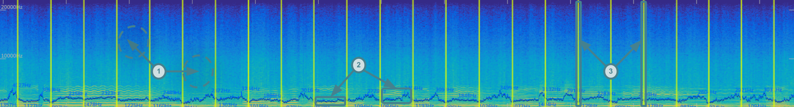

<h1 align="center">Partiels Manual</h1>

<p align="center">
<i>Version 1.2.0 for Windows, Mac & Linux</i><br>
<i>Manual by Pierre Guillot</i><br>
<a href="www.ircam.fr">www.ircam.fr</a><br><br>


</p>

<div style="page-break-after: always;"></div>

## Table of contents

* [1. Introduction](#1-introduction)
  * [1.1. Features](#12-system-requirements)
  * [1.2. System requirements](#12-system-requirements)
  * [1.3. Third-party](#13-third-party)
  * [1.4. Authorization](#14-authorization)
  * [1.5. Updates](#15-updates)
  * [1.6. Credits](#16-credits)
* [2. Overview](#2-overview)
* [3. Manage documents](#3-manage-documents)
  * [3.1. Create and open](#31-create-and-open)
  * [3.2. Save and consolidate](#32-save-and-consolidate)
  * [3.3. Edition and backup](#33-edition-and-backup)
* [4. Create new tracks](#4-create-new-tracks)
  * [4.1. Analysis tracks](#41-analysis-tracks)
  * [4.2. File tracks](#42-file-tracks)
* [5. Organize the tracks by groups](#5-organize-the-tracks-by-groups)
  * [5.1. Edition](#51-edition)
  * [5.2. Layout](#52-layout)
* [6. Visualize and edit track results](#6-visualize-and-edit-track-results)
  * [6.1. Plot](#61-plot)
  * [6.2. Table](#62-table)
* [7. Export analyses](#7-export-analyses)
  * [7.1. General options](#71-general-options)
  * [7.2. Image options](#72-images-options)
  * [7.3. Text and binary options](#73-text-and-binary-options)
  * [7.4. Batch processing](#74-batch-processing)
* [8. View, navigation, and transport](#8-view-navigation-and-transport)
  * [8.1. View](#81-view)
  * [8.2. Zoom](#82-navigation)
  * [8.3. Transport](#83-transport)
* [9. Track properties](#9-track-properties)
  * [9.1. Processor](#91-processor)
  * [9.2. Graphical](#92-graphical)
  * [9.3. Plugin](#93-plugin)
* [10. Group properties](#10-group-properties)
* [11. Audio files layout](#11-audio-files-layout)
  * [11.1. Audio files information](#111-audio-files-information)
  * [11.2. Audio files configuration](#112-audio-files-configuration)
  * [11.3. Audio files recovery](#113-audio-files-recovery)
* [12. Audio settings](#12-audio-settings)
* [13. Plug-ins settings](#13-plug-ins-settings)
* [14. Command-line tools](#14-command-line-tools)

<div style="page-break-after: always;"></div>

## 1. Introduction

**[Partiels](https://forum.ircam.fr/projects/detail/partiels/)** is an application for the **analysis of digital audio files** intended for *researchers* in signal processing, *musicologists*, *composers*, and *sound designers*. It offers a dynamic and ergonomic interface in order to **explore the content and the characteristics of sounds**.

### 1.1. Features

Partiels allows **analysis** one or several audio files using *Vamp* plug-ins, **loading** data files, **editing**, **organizing** and **visualizing** the analyses inside groups, and **exporting** the results as images or text files (in order to be used in other applications such as *Max*, *Pure Data*, *Open Music*, etc.).

- Versions for *Windows*, *Mac* & *Linux*  
- Multiformat & multichannel support  
- Multifile support (useful to compare audio files)  
- Analyzing audio with *Vamp* plug-ins  
- Visualizing results as *spectrogram*, *lines*, and *markers*  
- Drawing and editing results (copy/cut/paste/delete/duplicate/etc.)  
- Organizing and ordering analyses in groups  
- Exporting results to *PNG*, *JPEG*, *CSV*, *JSON*, *CUE* & *SDIF* file formats  
- Loading results from *CSV*, *JSON*, *CUE* & *SDIF* file formats  
- Converting results from *SDIF* to *JSON* file formats and inversely  
- Batch processing (useful to apply the same set of analyses on several audio files)  
- Command line interface to analyze, export and convert results  
- Consolidating documents (useful to share documents/analysis with other users across different platforms)  
- Audio playback with loop  

### 1.2. System Requirements

- MacOS 10.13 and higher (64bit - Universal Intel/Silicon)
- Linux (64 bit)
- Windows 10 and 11 (64 bit).

### 1.3. Third-party

Alongside Partiels, a set of analyses present in the AudioSculpt 3 application and based on the audio engines developed by the Ircam Analysis-Synthesis team are ported as Vamp plug-ins: 
- [SuperVP](https://forum.ircam.fr/projects/detail/supervp-vamp-plugin/)
- [IrcamBeat](https://forum.ircam.fr/projects/detail/ircambeat-vamp-plugin/)  
- [IrcamDescriptor](https://forum.ircam.fr/projects/detail/ircamdescriptor-vamp-plugin/) 
- [PM2](https://forum.ircam.fr/projects/detail/pm2-vamp-plugin/)

You will find a large number of analysis plug-ins on the [Vamp plug-in](https://www.vamp-plugins.org/) website.

### 1.4. Authorization

Partiels and the Ircam Vamp plug-ins are part of the [IRCAM Forum Premium](https://forum.ircam.fr/about/offres-dabonnement/) technologies bundle offering many tools, plug-ins, and applications to analyze, synthesize, and transform the sound. The free membership allows you to use the demo version Partiels with the Ircam Vamp plug-ins. 

To use the Partiels and the Ircam Vamp plug-ins without limitation, you must subscribe to the [IRCAM Forum Premium](https://forum.ircam.fr/about/offres-dabonnement/), download an authorization key from the [IRCAM Shop]("https://1.shop.ircam.fr/fr/index.php?controller=subscription"), and authorize the plugins using this authorization key.

</n>
<p align="center">

</p>
</n>

Open the authorization window from the interface by clicking on the `Authorize` entry via the main menu `Partiels → Authorize` (Mac) or `Help → Authorize` (Linux/Windows) or the `Demo` warning button. Click on the authorize button and select the file *Ircam_Authorization_Key.txt* downloaded from the IRCAM Shop (or drop directly the file into the window).

<p align="center">

</p>

Once the authorization key is validated (the process might take a few seconds), Partiels and the Ircam Vamp plug-ins can be used without limitation, the `Demo` buttons disappear, and `Authorize` entry of the the main menu is disabled.

If the Partiels and the Ircam Vamp are not authorized, the application runs in demo mode. There is no time limitation for the demo but you cannot export analysis results.

**Tip**: The IRCAM Forum Premium webpage to subscribe to the IRCAM Forum Premium membership and the IRCAM Shop webpage to download an authorization key can be accessed via the corresponding buttons in the authorization window. 

### 1.5. Updates

At startup, Partiels checks for the release of a new version on the Ircam forum. If a new version has been released, you can either go to the Partiels website to download it, ignore this version (you will not be notified of the release of a new version), or ask to be reminded at the next startup.

If you don't want Partiels to check for a new release on startup, you can toggle the option via the main menu `Help → Automatic Check for New Version`. 

You can manually check for a new version release on the Ircam Forum via the main menu `Help → Check for New Version`

### 1.6. Credits

**Partiels** is designed and developed by Pierre Guillot at [IRCAM](https://www.ircam.fr/) IMR Department.  
**Vamp** is designed and developed at the Centre for Digital Music, Queen Mary, University of London.

<div style="page-break-after: always;"></div>

## 2. Overview

Partiels has a main graphical interface to view, navigate and edit the different analyses of a document. The actions and interaction modes are presented in detail in the different sections of this manual.  

<p align="center"></p>

To begin the analysis and exploration of the sound, you must create or load a document as presented in the following section. 

<div style="page-break-after: always;"></div>

## 3. Manage documents

A document is the main item you work on in Partiels. It contains a set of analysis tracks organized by groups. You can create, edit, save and load documents.

### 3.1. Create and open

When you open Partiels for the first time or create a new document via the main menu `File → New...` or with the keyboard shortcut `⌘ Cmd + N` (Mac) or `Ctrl + N` (Linux/Windows), the application presents the interface for starting a new document. 

<p align="center"></p>

You are prompted to load one or more audio files or pre-existing Partiels document file. The application supports audio file extensions *.aac*, *.aiff*, *.aif*, *.flac*, *.m4a*, *.mp3*, *.ogg*, *.wav* and *.wma*. A Partiels document file has the extension *.ptldoc*. You can use the file browser window by clicking on the `Load` button (**A1**) or drag the files directly into the interface (**A1**). You can also load a Partiels document file via the main menu `File → Open...` or with the keyboard shortcut `⌘ Cmd + O` (Mac) or `Ctrl + O` (Linux/Windows). And you can select one of the recently used Partiels documents from the list on the right (**A2**) or via the main menu `File → Open Recent`.

If you have loaded one or more audio files, a second interface prompts you to add a new analysis track by clicking on the `Add Track` button (**A3**) to display the analysis plugin loading window. Alternatively, you can also use a pre-existing Partiels document as a template. Click on the `Load Template` button (**A4**) to display the file browser window or select one of the recently used Partiels documents from the list on the right (**A2**).

<p align="center"></p>

If you use a Partiels document as a template, all the analyses in this document will be applied to the audio files you have selected. The *block size* and *step size* analysis parameters can be adapted automatically by activating the corresponding toggle button (**A6**) if the sample rate used in the initial document differs from that of your audio files.

If you add a new track with an analysis plugin, you can refer to the [corresponding section](#add-new-plugin-tracks) of this manual.

### 3.2. Save and consolidate

A document can be saved as a file with the extension *.ptldoc* on your system via the main menu `File → Save...` or with the keyboard shortcut `⌘ Cmd + S` (Mac) or `Ctrl + S` (Linux/Windows). You can also create a copy of the existing document (e.g. if you want to keep a version of the original document) via the main menu `File → Duplicate...` or with the keyboard shortcut `⌘ Cmd + ⇧ Shift + S` (Mac) or `Ctrl + ⇧ Shift + S` (Linux/Windows). 

A document file is a text file describing its contents, such as audio files, analysis tracks, organization by groups. Audio files and analysis files used in a document are not embedded directly in the text file but saved as absolute paths to the files. If you delete or move these files on your system, the application will not be able to load the data and run the analyses properly and will prompt you to find or replace them. 

If you want to ensure the consistency and permanence of a document or if you want to share it with other users, you can consolidate it via the main menu `File → Consolidate...` or with the keyboard shortcut `⌘ Cmd + ⇧ Shift + C` (Mac) or `Ctrl + ⇧ Shift + C` (Linux/Windows). This operation creates a folder with the name of the document followed by *ConsolidatedFiles*. It copies all the audio files into this folder next to the document and replaces the absolute paths of the document file with relative ones. All the results are also saved as binary files. You can then move and share the document with its attached folder, the analysis results can be loaded even if the analysis plug-ins are no longer available.

You can reveal the current document file in the file browser of your operating system by clicking on the corresponding [text button](#2-overview) (**K5**) of the main interface.

### 3.3. Edition and backup

Partiels allows you to control many elements of a document by adding tracks, organizing groups, changing the audio configuration, etc. All changes made to a document can be undone or redone over and over again using the action history. To undo an action, you can use the main menu `Edit → Undo` or with the keyboard shortcut `⌘ Cmd + Z` (Mac) or `Ctrl + Z` (Linux/Windows).  To redo an action, you can use the main menu `Edit → Redo` or with the keyboard shortcut `⌘ Cmd + ⇧ Shift + Z` (Mac) or `Ctrl + ⇧ Shift + Z` (Linux/Windows). 

With each action, Partiels temporarily saves the current state of the document and if for some (unlikely) reason the application crashes. Upon reopening, Partiels will allow you to restore the document you were working on just before the crash.  

<div style="page-break-after: always;"></div>

## 4. Create new tracks

A track contains and displays data from a sound analysis. This data can be of three different types, each with its own representation:

<p align="center"></p>

- Matrix: A time point with a duration, and a vector of numerical values (e.g. the data generated by an FFT analysis). Matrices are represented by an image where the horizontal axis corresponds to time, the vertical axis to a vector and the color varies according to the numerical value of the elements of the vector (**1**). 
- Marker: A time point with a duration, and potentially a text label (e.g. data generated by a transient detection). Each marker is represented by a vertical line whose horizontal position depends on the time and thickness of the duration with potentially the adjacent label text (**2**). 
- Point: a time point with a duration, and potentially a numerical value (e.g. the data generated by an estimation of the fundamental frequency). The points define segments whose horizontal position depends on the time and vertical position depends on the numerical value. A point with a non-zero duration defines a horizontal line whose length depends on the duration. A point without numerical value stops the succession of segments (**3**).  

Tracks can be created in two ways, from the analysis of a Vamp plug-in or from a result file.

### 4.1. Analysis tracks

When you click on the button to add analysis tracks via the interface for starting a new document, the window for adding analysis plugins is displayed. If you are already working on a document, you can bring up this window to add new tracks via the main menu `Edit → Add New Track`, the keyboard shortcut `⌘ Cmd + T` (Mac) or `Ctrl + T` (Linux/Windows), or by using the drop-down menu of the `+` button ([Overview](#2-overview) - **K1**) on the main interface. 

All plug-ins installed on your computer are listed in the interface. You can organize the plug-ins by name, feature, maker, category or version in ascending or descending alphabetical order by clicking on the corresponding entry in the interface header (**P1**).

> For further information about the plug-in management, please refer to the [Plug-in settings](#12-plug-ins-settings) section.

<p align="center"></p>

You can also search for specific plug-ins by clicking on the text filter entry (**P2**) or by using the keyboard shortcut `⌘ Cmd + F` (Mac) or `Ctrl + F` (Linux/Windows), then typing the keyword corresponding to the plug-ins you wish to display (e.g. *tempo* or *spectrogram* for the feature or *ircam* for the manufacturer).

You can select one or more plug-ins and then press the `Return ⏎` key (or you can simply double click on a plug-in) to add a new track for each plug-in in your document (**P3**). If you are working on a new blank document, a default group is automatically created in which your new tracks appear. If you are working on a document that already contains groups and tracks, the new tracks are inserted after the last selected track or in the last selected group.

If you want to modify the analysis and graphical properties of a track, please refer to the [Track properties](#track-properties) section.

### 4.2. File tracks

A new track can be created by importing pre-calculated results from a file. This file can be generated from another Partiels document to avoid recalculating the analyses or from another application. The supported formats are JSON (*.json*), CSV (*.csv*), CUE (*.cue*) and SDIF (*.sdif*). You can bring up the file browser to select a file via the main menu `File → Import...` or with the keyboard shortcut `⌘ Cmd + ⇧ Shift + I` (Mac) or `Ctrl + Shift + I` (Linux/Windows). 


If you import a file in CSV format, the `Load File...` window appears allowing you to select the separator character between each column (*Comma*, *Space*, *Tab*, *Pipe*, *Slash*, *Colon*) to ensure compatibility with files generated by other applications that do not use commas. 

<p align="center">

</p>

When importing markers in CSV format, it is recommended to escape the tags (with single or double quotes for example) to ensure that the numeric values of the labels are considered as text.

If you are importing a file in SDIF format, , the `Load File...` window appears allowing you to define the frame code, matrix code, row and column to import.

<p align="center">

</p>

If you are importing a file in JSON  format containing an extra description of the track, the information is used to define the default graphical parameters and to give you the possibility to run the analysis using the original plugin if necessary.

If you are working on a new blank document, a default group is automatically created in which your new tracks appear. If you are working on a document that already contains groups and tracks, the new tracks are inserted after the last selected track or in the last selected group.

<div style="page-break-after: always;"></div>

## 5. Organize the tracks by groups

The analyses of a document are represented by tracks. These analysis tracks are organized in groups. Each group can contain several tracks, allowing the analysis representations to be superimposed. In a group, the tracks are superimposed from bottom to top. 

<p align="center">

</p>

It is therefore often preferable to place matrix type analyses, such as a sonogram, at the bottom and point or marker type analyses, such as spectral centroid or transient detection, on top. Thus the lines and markers will be displayed over the matrices.

### 5.1. Edition

Move tracks and groups by clicking on the track or group header to select it and then dragging the item to the desired location. In this way you can reorder tracks within a group, move a track within another group and reorder groups between themselves. 

<p align="center">

</p>

Use the keyboard modifier `Ctrl` during the move action of the selected track or group to duplicate it and move the copy of the item to the desired location.

> Selecting a track or a group with the keyboard modifier `Ctrl` without moving it allows you to quickly create a copy of the item that will be placed just above it. Then you can modify the analysis parameters of the copy to compare the results, for example.

Select a group or track by clicking on the item's header (or multiple tracks in a group by using the keyboard modifier `⇧ Shift`), then use the keyboard shortcuts `⌦ Delete` or `⌫ Backspace` to delete it.

Use the main menu `Edit → Add New Group`, the keyboard shortcuts `⌘ Cmd + G` (Mac) or `Ctrl + G` (Linux/Windows), or the drop-down menu of the `+` button ([Overview](#2-overview) - **K1**) on the main interface to create a new group that will be inserted after the last selected item.

### 5.2. Layout

Use the button (**K1**) on the header of a group to expand the group and show all the tracks of the group (e.g., *Group 2*) or conversely, to shrink the group and hide all the tracks of the group (e.g., *Group 1*). Use the button (**K2**) to expand or shrink all the groups in the document.

<p align="center">

</p>

The height of tracks and groups is variable and depends on two modes, manual (default) or automatic. Click on the button (**K3**) to activate or deactivate the automatic or manual mode. 

In automatic mode, the height of the tracks and groups will always be adapted according to the organization of the groups and tracks in the document and the height of the main window. 

In manual mode, the height of tracks and groups is free, click and drag on the bottom border of tracks and groups to resize them (**K4**). 

> In manual mode, you can still optimize the height of tracks and groups to the height of the main window by clicking the button (**K3**) with the keyboard modifier `⇧ Shift`.

If the overall cumulative height of groups and tracks exceeds the height of the interface, some groups and tracks may be partially hidden. Use the vertical scroll mouse or the scroll bar at the right of the interface to move the view and display the groups and tracks.

Use the `⇥ Tab` key to move the selection to the next visible track or group. 

<div style="page-break-after: always;"></div>

## 6. Visualize and edit track results

Track results can be manually visualized and edited directly on the graphical plot or in the result table to correct values and improve representation. Only marker or point tracks can be edited. 

Following editing, you can use the keyboard shortcuts `⌘ Cmd + Z` (Mac) or `Ctrl + Z` (Linux/Windows) to restore previous states, and `⌘ Cmd + Y` (Mac) or `Ctrl + Y` (Linux/Windows) or `⌘ Cmd + ⇧ Shift + Z` (Mac) or `Ctrl + ⇧ Shift + Z` (Linux/Windows) to reapply changes to both the graphical plot and the results table.

### 6.1. Plot

On the graphical plot, markers are represented by vertical lines on the timeline, points by a succession of segments - which can be interrupted - and vectors by a sonogram-like matrix.  Markers and points can be created, deleted, copied, pasted, and duplicated. Markers can also be moved over time.

- Click with `⌘ Cmd` (Mac) or `Ctrl` (Linux/Windows) on a marker track to create a new marker at the corresponding time.  
- Click and drag with `⌘ Cmd` (Mac) or `Ctrl` (Linux/Windows) on a point track to create new points at the corresponding times and values.  
- Press the `Delete ⌫` key to delete markers or points within the selected time range and on selected tracks and channels.
- Use the keyboard shortcut `⌘ Cmd + C` (Mac) or `Ctrl + C` (Linux/Windows) to copy markers or points in the selected time range and on selected tracks and channels to the clipboard.
- Use the keyboard shortcut `⌘ Cmd + X` (Mac) or `Ctrl + X` (Linux/Windows) to cut markers or points in the selected time range and on selected tracks and channels to the clipboard.
- Use the keyboard shortcut `⌘ Cmd + V` (Mac) or `Ctrl + V` (Linux/Windows) to paste markers or points saved in the clipboard at the playhead position.
- Use the keyboard shortcut `⌘ Cmd + D` (Mac) or `Ctrl + D` (Linux/Windows) to duplicate markers or points in the selected time range and on selected tracks and channels at the end of the selected time range.
- Use the keyboard shortcut `i` to insert markers or points at the playhead position (if the playback is running) or at the start and end of the selected time range (if the playback is not running). 
- Use the keyboard shortcut `b` to insert a point with no value (to break the continuity of the segments) at the playhead position (if the playback is running) or at the start of the selected time range (if the playback is not running). 
- Click and drag a marker to move it to the desired time.
- Double-click on a marker to display the results table, focusing on the selected element.

### 6.2. Table

The results table displays data in three columns, the first corresponding to time, the second to duration, and the third to the label for markers, the numerical value for points, and the list of values for vectors. Markers and points can be deleted, copied, pasted, and duplicated. The time, duration, label, or value of markers and points can be edited.

- Click on a cell to edit the time, duration, label or value of a point or marker.
- Press the `Delete ⌫` key to delete markers or points of the selected rows.
- Use the keyboard shortcut `⌘ Cmd + C` (Mac) or `Ctrl + C` (Linux/Windows) to copy markers or points of the selected rows to the clipboard.
- Use the keyboard shortcut `⌘ Cmd + X` (Mac) or `Ctrl + X` (Linux/Windows) to cut markers or points of the selected rows to the clipboard.
- Use the keyboard shortcut `⌘ Cmd + V` (Mac) or `Ctrl + V` (Linux/Windows) to paste markers or points saved in the clipboard at the start of the selected rows.
- Use the keyboard shortcut `⌘ Cmd + D` (Mac) or `Ctrl + V` (Linux/Windows) to duplicate markers or points of the selected rows.

## 7. Export analyses

The results of the analyses of a document can be exported in different formats, as an image, text or binary file. You can display the export window via the main menu `File → Export...` or with the keyboard shortcut `⌘ Cmd + ⇧ Shift + E` (Mac) or `Ctrl + Shift + E` (Linux/Windows). This window allows you to select the analysis(es) to be exported, define the time range, the format and the options for this format. 

<p align="center">

</p>

Once you have selected the desired configuration, click on the `Export` button (**E5**), you will be prompted to select an output file or a folder if you are exporting several analyses in separate files (the name of the files will be generated automatically with the name of the group and the track).

### 7.1. General options

The `Item` drop-down (**E1**) menu allows you to select the document, a group or an analysis. If you select the document, all the analyses of the document will be exported and if you select a group, all the analyses of the group will be exported (in the case of a text format it is possible to ignore the matrix analyses to avoid unwanted large files, see [Text and binary options](#63-text-and-binary-options)). 

<p align="center">

</p>

The four time range options (**E2**) allow you to define the time range to be exported. 

The `Time Preset` drop-down menu allows you to select one of three presets: *Global* to export the entire time range of the document, *Visible* to export the time range visible on the screen, and *Selection* to export the time range corresponding to the current selection. 

<p align="center">

</p>

You can also define the time range with the text entries `Time Start`, `Time End`, and `Time Length`, the preset then automatically switches to *Manual* mode. 

<p align="center">

</p>

The `Format` drop-down menu (**E3**) allows you to select the output format. This can be an image format *JPEG* or *PNG* , a text format *JSON*, *CSV* or *CUE* or a binary format *SDIF*. For each format, you can set specific options (**E4**).

### 7.2. Images options

Exporting to an image format (*JPEG* or *PNG*) offers two rendering options:

The `Preserve Group Overlay` button toggles the preservation of the group overlay display if you are exporting the entire document or a group (so this option is not available when exporting a single track). Each group will be exported as an image including all its tracks. If the option is disabled, each track will be exported separately.

<p align="center">

</p>

The `Image Size` dropdown menu offers presets to control the size of the image. If the *Current Size(s)* item is selected, the export mechanism uses the current visible sizes of the tracks and groups. The *Manual* item is selected if the width and height of the image are defined manually and don't match one of the presets.

The `Image Width` and `Image Height` number fields can be used to manually define the width and the height of the images in pixels.

### 7.3. Text and binary options

The `Ignore Matrix Tracks` button offers an option to ignore matrix analyses (such as sonograms) that are usually only visually relevant and contain a lot of information generating large files. 

Export to CSV offers two options:
- `Include Header Row` enables the writing of a header line including the titles of the columns (e.g. *time*, *duration*, *label*).
- `Column Separator` allows to define the separator character between each column (*Comma*, *Space*, *Tab*, *Pipe*, *Slash*, *Colon*). This can facilitate the parsing of files in other applications. 

Export to JSON offers one option:
- `Include Extra Description` enables writing a JSON object after the results containing all the properties of the audio processor for analysis and graphical rendering of the track. This allows to automatically optimize the display of the analysis but also to restart the analysis if needed.

Export to SDIF offers three options:
- `Frame Signature` defines the frame signature to encode the results in the SDIF file. 
- `Matrix Signature` defines the matrix signature to encode the results in the SDIF file. 
- `Column Name` defines the name of the column to encode the results in the SDIF file.

### 7.4. Batch processing

You can use the current document as a template to generate results for other audio files using the batch processing system. To do this, open the batch window via the main menu `File → Batch...` or with the keyboard shortcut `⌘ Cmd + ⇧ Shift + B` (Mac) or `Ctrl + Shift + B` (Linux/Windows). 

<p align="center">

</p>

This window top section (**B1**) allows you to select audio files and configure their channels layout.

- Add items: Click on the `+` button to select one or several files using the file browser window or drag and drop one or several audio files or a folder from the operating system's file browser. A new item is created for each audio file. 

- Delete items: Select one or several items (with the `Ctrl` or `⇧ Shift` keys) by clicking on the name part of the item and press the `Delete ⌫` key to remove items from the audio files layout.

- Move an item: Click on the `#` index part of the item, drag the item to a new position above or below and drop the item to reorder the audio file configuration and update the indices.
<p align="center">

</p>

- Copy an item: Click on the `#` index part of the item with the `Ctrl` key pressed to duplicate an item, then drag and drop to insert the new item the desired position.

- Modify an item's channels: Click on the channel drop-down menu and select the desired configuration (*all* analyses all channels separetily, *mono* sums all channels into one channel).  
<p align="center">

</p>

- Undo changes: Use the undo key command `⌘ Cmd + Z` (Mac) or `Ctrl + Z` (Linux/Windows) to restore previous states. Note the undo/redo mechanism is relative to this panel only (until the changes are applied to the document).

- Redo changes: Use the redo key commands `⌘ Cmd + Y` (Mac) or `Ctrl + Y` (Linux/Windows) or `⌘ Cmd + ⇧ Shift + Z` (Mac) or `Ctrl + ⇧ Shift + Z` (Linux/Windows) to reapply changes. Note the undo/redo mechanism is relative to this panel only (until the changes are applied to the document).

`Adapt to Sample Rate` (**B2**) enables the adaptation of the *block size* and *step size* analysis parameters if the sample rate used in the current document differs from that of the audio files.

Once you have selected the desired configuration, click on the `Process` button (**B3**), you will be prompted to select a folder (the name of the files will be generated automatically with the name of the audio files, the groups and the tracks).

<div style="page-break-after: always;"></div>

## 8. View, navigation, and transport

This section covers aspects related to viewing, navigation and audio playback in the application.

Change the general theme of the application, by default the automatic mode adapts to the theme changes (light and dark) of your operating system via the menu `View → Theme`.

Change the global scale of the application via the menu `View → Scale` to enlarge the global view of the application.

Toggle the magnetize option by clicking on the button `Magnetize` button in the main interface ([Overview](#2-overview) - **K6**) or using the main menu `Transport → Toggle Magnetize`. If the magnetize option is enabled the position moves to the closest markers of all the tracks of the document. 

### 8.1. View

Each track and group offers two representations of the analysis results. The main representation shows the results over time ([Overview](#2-overview) **V2**) as vertical lines for the markers, points (connected in segments) for the values and images for the matrices. The secondary display shows an instantaneous value of the results at the time of the playhead ([Overview](#2-overview) **V1**).

- Activate the info bubble window with the `Info Bubble` button ([Overview](#2-overview) **K7**), via the main menu `View → Info Bubble` or the keyboard shorcut `⌘ Cmd + I` (Mac) or `Ctrl + I` (Linux/Windows) to display the values of the analysis results when you hover the mouse over these representations.

- Modify the display of track and group grids with the `Grid` button ([Overview](#2-overview) **K8**): hidden, ticks, full.

### 8.2. Navigation

Partiels offers the possibility of navigating and zooming in on the horizontal axis corresponding to the time range, and in on the vertical axis corresponding to the value or frequency ranges.

Click and drag on a track or a group to select a time range. If the magnetize option is enabled, the position moves to the closest marker. The time selection can be visualized and edited with the time entries on the header of the main interface ([Overview](#2-overview) - **S**).

#### 8.2.1 Horizontal axis  

The main interface contains a horizontal ruler and a horizontal bar ([Overview](#2-overview) **Z1** and **Z2**) to control the time zoom. You can also use the mouse and trackpad interaction or keyboard shortcuts to navigate and zoom. 

- Click and drag on the horizontal ruler ([Overview](#2-overview) **Z1**) to zoom in and out and to shift the time range backwards and forwards.
- Click with `⇧ Shift` and drag to the left and right on the horizontal ruler ([Overview](#2-overview) **Z1**) to shift the time range backwards and forwards. 
- Click with `Alt` and drag up and down on the horizontal ruler ([Overview](#2-overview) **Z1**) to zoom out and in of the time range.
- Click with `⌘ Cmd` (Mac) or `Ctrl` (Linux/Windows) and drag on the horizontal ruler ([Overview](#2-overview) **Z1**)to select a time range to zoom to.
- Click with `⎇ Option` (Mac) or `Alt` (Linux/Windows) on the horizontal ruler ([Overview](#2-overview) **Z1**) to show a floating window that allows to textually specify the zoom range. 
- Double-click on the horizontal ruler ([Overview](#2-overview) **Z1**) to zoom on the entire time range.
- Click on the horizontal bar ([Overview](#2-overview) **Z2**) to shift the time range backwards and forwards.
- Double-click on the horizontal ruler ([Overview](#2-overview) **Z1**) to reset the time zoom to the global time range.
- Scroll vertically with `⇧ Shift` (or scroll horizontally) using the mouse-wheel to shift the time range backwards and forwards.
- Scroll vertically using the mouse-wheel to zoom in and out of the time range.
- Use the pitch-zoom to zoom in and out of the time range.
- Zoom in with the keyboard shortcut `⌘ Cmd + +` (Mac) or `Ctrl + =` (Linux/Windows) or via the main menu `View → Time Zoom In`.
- Zoom out with the keyboard shortcut `⌘ Cmd + -` (Mac) or `Ctrl + -` (Linux/Windows) or via the main menu `View → Time Zoom Out`.

#### 8.2.2 Vertical axis

The interface of each point or matrix track contains a vertical ruler for each channel and one vertical bar for all the channels ([Overview](#2-overview) **Z3** and **Z4**) to control the value or frequency zooms (the maker tracks don't have vertical zoom). The corresponding rulers and bars also appear also on group if the group zoom reference is a point or a matrix track. You can also use the mouse and trackpad interaction or keyboard shortcuts to navigate and zoom. 

-- Click and drag on the vertical ruler ([Overview](#2-overview) **Z1**) to zoom in and out and to shift the value or frequency range backwards and forwards.
- Click with `⇧ Shift` and drag up and down on the vertical ruler ([Overview](#2-overview) **Z3**) to shift the value or frequency range backwards and forwards.
- Click with `Alt` and drag left and right on the vertical ruler ([Overview](#2-overview) **Z1**) to zoom out and in of the value or frequency range.
- Click with `⌘ Cmd` (Mac) or `Ctrl` (Linux/Windows) and drag on the vertical ruler ([Overview](#2-overview) **Z3**) to select a value or frequency range to zoom to.
- Click with `⎇ Option` (Mac) or `Alt` (Linux/Windows) on the vertical ruler  ([Overview](#2-overview) **Z3**) to show a floating window that allows to textually specify the zoom range. 
- Double-click on the vertical ruler ([Overview](#2-overview) **Z3**) to zoom on the entire value or frequency range.
- Click on the vertical bar ([Overview](#2-overview) **Z4**) to shift the value or frequency range backwards and forwards.
- Scroll vertically or horizontally with `Ctrl` using the mouse-wheel to zoom in and out of the value or frequency range.
- Scroll vertically with `Ctrl` and `⇧ Shift` using the mouse-wheel to shift the value or frequency range backwards and forwards.
- Use the pitch-zoom with `Ctrl` to zoom in and out of the value or frequency range.
- Zoom in with the keyboard shortcut `⌘ Cmd + ⇧ Shift + +` (Mac) or `Ctrl + ⇧ Shift + =` (Linux/Windows) or via the main menu `View → Vertical Time Zoom In`.
- Zoom out with the keyboard shortcut `⌘ Cmd + ⇧ Shift + -` (Mac) or `Ctrl + ⇧ Shift + -` (Linux/Windows) or via the main menu `View → Vertical Time Zoom Out`.

### 8.3. Transport

Partiels provides basic audio playback capabilities to allow listening to audio files while viewing analysis results. Audio playback can be controlled with the transport interface ([Overview](#2-overview) **T**) in the center of the main interface header.

<p align="center">

</p>

The actions to move the start position of the playback head and control the playback loop depend on the magnetize option that sticks the positions to the markers of the analysis tracks.

- Toogle the audio playback: Click the playback button (**T1**), use the main menu `Transport → Toggle Playback` or the space bar `⎵` to start or stop audio playback at the playhead's starting position. 
- Toogle the audio loop: Click on the loop button (**T2**), use the main menu `Transport → Toggle Loop` or the keyboard shortcut `⌘ Cmd + L` (Mac) or `Ctrl + L` to enable or disable the audio loop.
- Control the loop range: Use the loop bar (**T4**) to control le loop range, if the the magnetize option is enabled, the positions move to the closest markers.
  - Click on the borders of the existing loop range without any keyboard modifier and dragging to resize the starting or the ending of the loop range.
  - Click and drag anywhere else without any keyboard modifier to select a new loop range.
  - Click and drag with `⇧ Shift` on the loop range to shift the loop range over the time.
  - Double click on the loop bar to select the range between the two closest markers.
- Stop the playback automatically at the end of the loop: Use the main menu `Transport → Toggle Stop Playback at Loop End` to enable or disable the option.
- Rewind playhead: Click the rewind button (**T3**), use the main menu `Transport → Rewind Playhead` or the keyboard shortcut `⌘ Cmd + W` (Mac) or `Ctrl + W` to move the playhead to the beginning of the audio files or the beginning of the play loop if the loop is enabled.  
- Move playhead backward: Use the main menu `Transport → Move the Playhead Backward` or the keyboard shortcut `⌘ + ←` (Mac) or `Ctrl + ←` to move the playhead to the previous marker when the magnetize option is enabled.  
- Move playhead forward: Use the main menu `Transport → Move the Playhead Forward` or the keyboard shortcut `⌘ + →` (Mac) or `Ctrl + →` to move the playhead to the next marker when the magnetize option is enabled.  
- Set playhead position: Use the time entry (**T6**) when the the playback is stopped to define the start playhead position. When the playback is started, the time entry displays the running playhead position. Click on an analysis to move the start playhead position at the corresponding time position, if the magnetize option is enabled, the position moves to the closest marker. 
- Control the volume: Cick and drag the volume slider (**T7**) to control the volume of the audio output.


> Refer to these sections to configure the [audio files layout](#10-audio-files-layout) and the [audio settings](#11-audio-settings).

<div style="page-break-after: always;"></div>

## 9. Track properties

The track properties panel allows you to access information about a track and to change the processor and graphic properties. You can display a track's properties panel by clicking on the corresponding button in the track's header ([Overview](#2-overview) - **K2**) or via the corresponding entry in the drop-down menu displayed by the properties button of the group header containing the track ([Overview](#2-overview) - **K3**).

<p align="center">

</p>

The first property of a track is its name. The default name of the track corresponds to either the name of the analysis plugin if a plugin has been used to create the track or to the name of the results file if a results file has been used to create the track. The name of the track can be modified using the corresponding text field. The properties of a track are then organized in three categories: processor, graphical, plugin.  

### 9.1. Processor

The processor section allows you to modify all the properties that control the analysis engine or the loading of the results file of the track. Thus, the properties are related to the result file, the plugin parameters and the track state.

#### 9.1.1. File

The results file information is displayed if the analysis results have been loaded from a file. Note that, if the analysis results were loaded from a JSON file containing plugin information or a file resulting from the consolidated track, the processor's parameters can still be accessible and used to update the analysis results.

<p align="center">

</p>

- The results file can be revealed in the operating system's file browser by clicking on the text button. 

- The results file can be detached from the track (only if the track contains plugin information) by clicking on the text button with the `shift` keys pressed. In this case, the track will use the plugin information to run the analysis and produce new results.

#### 9.1.2. Parameters 

Depending on the characteristics of the plugin, the section allows accessing the default plugin parameters. If the plugin expects frequency domain input signal, the section gives access to the window type, the block size and the step size in order to transform the time domain signal into a frequency domain signal with a Fast Fourier Transform. Otherwise, if the plugin expects time domain input signal, the section gives access to the block type if the plugin doesn't have a preferred block size, the step size if the plugin doesn't have a preferred step size or doesn't expect the step size to  be equal to the block size.

<p align="center">

</p>

- Window Type: The window function of the FFT in order to transform the time domain signal into a frequency domain signal if the plugin expects frequency domain input signal.

- Block Size: The window size of the FFT in order to transform the time domain signal into a frequency domain signal signal if the plugin expects frequency domain input data or the size of the blocks of samples if the plugin expects time domain input signal. 

- Step Size: The step size of the FFT in order to transform the time domain signal into a frequency domain signal if the plugin expects frequency domain signal or the size between each block of samples if the plugin expects time domain input signal. 

<p align="center">

</p>

- Input Track: The input track property allows you to use another document analysis track as input to the current analysis track. To do this, the analysis plugin must allow it, and the input data type must correspond to the data type expected by the plugin. Changing the input track or modifying the results of this track automatically triggers a re-analysis of the current track.

The section allows accessing the plugin-specific parameters that are used to perform the analysis. Depending on their specifications, the values of the parameters can be controlled by a toggle button (on/off), a number field (integer or floating-point values), or a dropdown menu (list of items). Modifying the parameters triggers the analysis and produces new results. If the track is loaded from a file or if the analysis results have been edited, the application displays a dialog window warning you that the file will be detached from the track before performing the analysis and asking you if you want to proceed (you can still undo the operation to retrieve the previous analysis results). 

<p align="center">

</p>

The preset menu allows you to restore the factory value of the parameters. You can also save the current state of the parameters in a file on your operating system and load this file to restore the state (the file can be used in any other track that used the same plugin).

#### 9.1.3. State

The current state of the plugin is displayed at the bottom of the section informing if the analysis or loading succeeded or failed and if the results have been edited.

<p align="center">

</p>

If the analysis or loading failed, clicking on the warning icon prompts a dialog window offering to solve the problem when possible (by loading another plugin or another file if it is not found or by restoring the default state of the plugin if its initialization failed).

If the analysis results have been edited, clicking on the warning icon prompts a dialog window offering to cancel the changes and relaunch the analysis.

### 9.2. Graphical

The graphical section allows modifying all the properties that control the rendering of the analysis results of the track. The properties depend on the type of analysis results: markers (e.g. beat detection), points (e.g. energy estimation), or columns (e.g. spectrogram).

#### 9.2.1. Colors

A color can be modified using the color selector that is prompted by clicking on the colored button. You can drag and drop a colored button on another one, to copy the color from one property to another. The color map can be modified using the dropdown menu. 

<p align="center">
<br>

</p>

- Color Map: The color map used to render the columns.
- Foreground Color: The color used to render the markers or the segments between points.
- Background Color: The color used to render the background behind the markers or the segments between points.
- Text Color: The color used to render the labels of the markers or the points values.
- Shadow Color: The shadow color used to render the shadow of the markers or the segments between points.

#### 9.2.2. Font

The font properties are only available for marker or point type analyses. By default, the font *Nunito Sans* with a size of 14 and a regular style is used. You can change the font according to the ones available on your system (if you load a document using a font that is not present on your system, the default font is used). It may be necessary to use another font if some characters are not supported.

<p align="center">

</p>

- Font Name: The name of the font used to render the labels of the markers or the  values of the points.
- Font Style: The style of the font used to render the labels of the markers or the  values of the points. The list of available styles depends on the font family (name).
- Font Size: The size of the font used to render the labels of the markers or the  values of the points. You can click on the text to define textually a size that would not be accessible in the list.

#### 9.2.3. Ranges

The value range of the points and the columns results can be adapted to optimize the graphical rendering. It will corresponds to the range of the vertical axis for the points rendering or to the color mapping for the column rendering. By default, the value range is based on the information given by the plugin or stored in the results file if available, otherwise it will be based on the minimum and maximum values of the results but it can also be modified manually.

<p align="center">

</p>

- Value Range Mode: Select the value range mode: default (if available), results, manual (selected automatically when the range doesn't match one of the two other mode)
- Value Range Min.: The minimum possible value for the results (the value differs from the visible value that corresponds to the zoom on the vertical axis for the points rendering or the color mapping for the column rendering).
- Value Range Max.: The maximum possible value for the results (the value differs from the visible value that corresponds to the zoom on the vertical axis for the points rendering or the color mapping for the column rendering).
- Value Range Link: If the visible value range of the points corresponding to the vertical axis is linked to the the vertical axis of the group containing the track.  
- Value Range: The visible value range for the column rendering (the range controls the color mapping).
- Num. Bins: The maximum number of bins (of values) by column (the value is fixed). 
- Bin Range Link: If the visible bin range of the columns corresponding to the vertical axis is linked to the the vertical axis of the group containing the track. 
- Grid: Prompt a dialog window to control the grid properties of the track
  - Tick Reference Value: The reference value from which the ticks are distributed.
  - Main Tick Interval: The number of small ticks between main ticks. 
  - Power Base: The power base used to compute the tick distribution.
  - Ruler Mode: A set of presets for the main tick interval and the power base that can be used to easily corresponds to amplitude range, frequency range, etc.

#### 9.2.4. Visibility 

- Show in the group overlay view: The toggle button allows to show or hide the track in the group overlay view. This property can also be changed with the other groups via the [group properties](#9-group-properties) window.

- Channel Layout: The channel layout button allows to show or hide channels of the analysis results. This channel layout is only graphical and doesn't change the audio analysis nor the audio playback (please refer to the audio files layout section). This property can also be changed with the other groups via the [group properties](#9-group-properties) window.

### 9.3. Plugin

The graphical section displays information about the plugin such as the name, the feature, the maker, the version, the  markers, the category and the description and the copyright.

<div style="page-break-after: always;"></div>

## 10. Group properties

The group properties panel allows you to access information about a group and to change the processor and graphic properties of its tracks. You can display a group's properties panel via the corresponding entry in the drop-down menu displayed by the properties button of the group header ([Overview](#2-overview) - **K3**).

<p align="center">

</p>

The first entries correpond to exclusive properties of the group :
- Name: The property defined the name of the group as it appears on the group header or when exporting results. By default, a group is named "Group" followed by its index of creation.
- Background Color: The property defines the background color used to render the overlay of the tracks. By default, the color is transparent.
- Zoom Reference: This property defines which track is used as a reference for the vertical zoom of the group. As tracks can have different vertical zoom ranges or none (when tracks contain markers), it is necessary to define which one is used for zooming and the grid when rendering the tracks overlay.  By default, the group uses the frontmost track, but you can select another track if it does not meet your needs.

The following sections Processor and Graphical contain all the properties of the group tracks. Using one of the entries in the group properties panel changes the associated property of all the tracks in the group (which have this property). This can be a way to globally modify a parameter such as the window size.

## 11. Audio files layout

The audio files layout panel allows you to access information about the audio files of the document, reveal the audio files in the operating system's file browser, and rearrange the files configuration of the audio reader. You can display the audio files layout panel by clicking on the corresponding button in the main interface ([Overview](#2-overview) - **K4**).

<p align="center">

</p>  

### 11.1. Audio files information

Select an audio file by clicking on its name in section (**S1**) to display its information (format, sample rate, bits, length in samples, duration in seconds, number of channels, metadata, etc.) in section (**S2**) of the panel. The audio file can be revealed in the operating system's file browser by clicking on the text button on top of section (**S2**).

### 11.2. Audio files configuration

The audio files layout is used by both the audio playback engine and the audio analysis engine so modifying the audio files layout triggers the reanalysis of all the analysis tracks that have not been consolidated. 

> If you need a different channel routing for audio playback than for audio analysis (to mute some channels for example), you can use the routing matrix of the [audio settings](#audio-settings).  

An item of the audio files layout in section (**S1**) is defined by an index, an audio file and a channel configuration. Each item corresponds to a channel of the audio files layout. So different audio files can be assigned to the different channels of the audio files layout using for each a specific channel layout. 

- Add items: Click on the `+` button to select one or several files using the file browser window or drag and drop one or several from the operating system's file browser. A new item is created for each channel of a new file,  (so adding a stereo audio file, creates two new items assigned to channels one and two of the audio file). ⚠️ Using audio files with different sample rates is not supported and may lead to invalid analysis results and poor audio playback, the app will warn you to avoid such issues.

- Delete items: Select one or several items (with the `Ctrl` or `⇧ Shift` keys) by clicking on the name part of the item and press the `Delete ⌫` key to remove items from the audio files layout.

- Move an item: Click on the `#` index part of the item, drag the item to a new position above or below and drop the item to reorder the audio file configuration and update the indices.
<p align="center">

</p>

- Copy an item: Click on the `#` index part of the item with the `Ctrl` key pressed to duplicate an item, then drag and drop to insert the new item the desired position.

- Modify an item's channels: Click on the channel drop-down menu and select the desired configuration (*mono* sums all channels into one channel).  
<p align="center">

</p>

- Undo changes: Use the undo key command `⌘ Cmd + Z` (Mac) or `Ctrl + Z` (Linux/Windows) to restore previous states. Note the undo/redo mechanism is relative to this panel only (until the changes are applied to the document).

- Redo changes: Use the redo key commands `⌘ Cmd + Y` (Mac) or `Ctrl + Y` (Linux/Windows) or `⌘ Cmd + ⇧ Shift + Z` (Mac) or `Ctrl + ⇧ Shift + Z` (Linux/Windows) to reapply changes. Note the undo/redo mechanism is relative to this panel only (until the changes are applied to the document).

- Apply changes: If the audio files layout differs from the one currently used by the document, click the `Apply` text button in section (**S3**) to apply the new audio files layout to the document. Note that when the changes are applied to the document, the undo/redo mechanism can be used in the document to restore the previous state of the audio files layout.

- Reset changes: If the audio files layout differs from the one currently used by the document, click the `Reset` text button in section (**S3**) to restore the audio files layout of the document. 

### 11.3. Audio files recovery

If audio files cannot be found (files have been moved or deleted for example), the item names corresponding to the missing files are greyed out and a warning appears at the bottom of the (**S1**) section. 

<p align="center">

</p>

Click on an item's name to display a dialog window asking you to recover the missing audio file using the operating system's file browser. 

<div style="page-break-after: always;"></div>

## 12. Audio settings

The audio settings window allows you to control device management and channels routing for audio playback. These settings have no effect on the analysis or graphics rendering. The audio settings window can be displayed via the main menu `Partiels → Audio Settings...` (Mac) or `Help → Audio Settings...` on (Linux/Windows) or with the keyboard shortcut `⌘ Cmd + ,` (Mac) or `⌘ Cmd + P` (Linux/Windows).

<p align="center">

</p>

- Driver (**A1**): The dropdown menu allows to select the audio driver from those available on the computer (typically, CoreAudio on Mac, WASAPI, DirectSound, and ASIO on Windows, ALSA, and Jack on Linux).  
- Output Device (**A2**): The dropdown menu allows to select the audio output device from those connected to the computer and supported by the driver.
- Sample Rate (**A3**): The dropdown menu allows to select the sample rate from those supported by the output device. Higher sample rates increase the audio quality in high frequencies at the expense of increased CPU drain.
- Buffer Size (**A4**): The dropdown menu (Mac) or the number entry (Windows & Linux) allows selecting the buffer size from those supported by the output device. Lower buffer size reduces the latency at the expense of increased CPU drain. If dropouts or crackle occur during playback, the buffer size should be reduced.
- Channels Routing (**A5**): The button matrix allows you to configure to which output channels the application's channels are sent. The number of application channels depends on the [audio files layout](#audio-files-layout). The number of output channels depends on the selected audio device. The matrix can be used to mute some channels of the audio files layout.
- Audio Device Panel (**A6**): The Audio Device Panel button opens the audio device panel of the manufacturer if supported by the audio driver.

When changed, the audio settings are saved automatically on the computer and restored when reopening the application. The audio settings can be deleted manually to restore the default configuration when reopening the application. The audio settings are located:
- Mac: *~/Library/Application Support/Ircam/Partiels.audio.settings*
- Windows: *C:\\Users\\"username"\\AppData\\Roaming\\Ircam\\Partiels.audio.settings*
- Linux: *~/Ircam/Partiels.audio.settings*

<div style="page-break-after: always;"></div>

## 13. Plug-ins settings

The application uses [Vamp plug-in technology](https://www.vamp-plugins.org/), an audio processing plug-in system that extract descriptive information from audio data developed at the Centre for Digital Music, Queen Mary, University of London. 

At startup, the application scans for the Vamp plug-ins installed on your machine. You can control the folders in which the application should look using the Plugin Settings window that can be displayed via the main menu `Partiels → Plugins Settings...` (Mac) or `Help → Plugins Settings...` on (Linux/Windows). 

<p align="center">

</p>

In the upper section of the Plugin Settings window, each item in the list corresponds to a folder. The order of the item corresponds to the order in which the application explores the folders.

- Add items: Click on the `+` button (**P1**) to select a folder using the file browser window or drag and drop a folder from the operating system's file browser.

- Delete items: Select one or several items (**I2**) (with the `Ctrl` or `⇧ Shift` keys) by clicking on the name part of the item and press the `Delete ⌫` key to remove items from the audio files layout.

- Move an item: Click on the index part of the item (**I1**), drag the item to a new position above or below and drop the item to reorder the audio file configuration and update the indices.

- Copy an item: Click on the index part of the item (**I1**) with the `Ctrl` key pressed to duplicate an item, then drag and drop to insert the new item the desired position.

- Modify the folder: Click on the `Change` button (**I3**) to display a file browser window and select another folder.

- Reveal the folder: Click on the `Folder` button (**I4**) to reveal the folder in   operating system's file browser.

- Undo changes: Use the undo key command `⌘ Cmd + Z` (Mac) or `Ctrl + Z` (Linux/Windows) to restore previous states. Note the undo/redo mechanism is relative to this panel only (until the changes are applied to the document).

- Redo changes: Use the redo key commands `⌘ Cmd + Y` (Mac) or `Ctrl + Y` (Linux/Windows) or `⌘ Cmd + ⇧ Shift + Z` (Mac) or `Ctrl + ⇧ Shift + Z` (Linux/Windows) to reapply changes. Note the undo/redo mechanism is relative to this panel only (until the changes are applied to the document).

- Apply changes: Click on the `Apply` button (**P2**) to save the changes. If you modify the folders, you will be asked to restart the application to scan for plug-ins.

- Reset changes: Click on the `Reset` button (**P3**) to reset the settings to the saved state.

- Reset to default: Click on the `Default` button (**P4**) to reset the settings to the default state.

- Use environment variable: Enable or disable the use of the `VAMP_PATH` environment variable to define the extra folders. On MacOS, the option is accessible by clicking on the `Option` button (**P5**). On Windows and Linux, a toggle button replaces the button.

- Quarantine management: Control the quarantine management when plug-ins are not notarized. Either it "Keep the default system mechanism", the system will probably suggest you to delete the plug-ins in question. Or it "Attemp to open quarantined libraries", the application will try to override the quarantine, you will have to restart the application to take into account the change. Or it "Ignore quarantined libraries", the application will ignore the plug-ins.

<div style="page-break-after: always;"></div>

## 14. Command-line tools

The Partiels executable can be used as a command line tool. The command line tool provides functionality to load documents, create documents and run analyses and export the results. It also provides functions to parse SDIF files to JSON and vice versa. All the functionality is documented in the help command:

```
Usage:
 Partiels --help|-h              Prints the list of commands
 Partiels --version|-v           Prints the current version number
 Partiels [file(s)]              Loads the document or creates a new document with the audio files specified as arguments.
 Partiels --new|-n [options]     Creates a new document with a template and an audio file.
	--input|-i <audiofile> Defines the path to the audio file to analyze (required).
	--template|-t <templatefile> Defines the path to the template file (required).
	--output|-o <outputfile> Defines the path of the output file (required).
	--adapt Defines if the block size and the step size of the analyzes are adapted following the sample rate (optional).
	
 Partiels --export|-e [options]  Analyzes an audio file and exports the results.
	--input|-i <audiofile> Defines the path to the audio file to analyze (required).
	--template|-t <templatefile> Defines the path to the template file (required).
	--output|-o <outputdirectory> Defines the path of the output folder (required).
	--format|-f <formatname> Defines the export format (jpeg, png, csv, json, cue or sdif) (required).
	--width|-w <width> Defines the width of the exported image in pixels (required with the jpeg and png formats).
	--height|-h <height> Defines the height of the exported image in pixels (required with the jpeg and png formats).
	--adapt Defines if the block size and the step size of the analyzes are adapted following the sample rate (optional).
	--groups Exports the images of group and not the image of the tracks (optional with the jpeg and png formats).
	--nogrids Ignores the export of the grid tracks (optional with the csv, json or cue formats).
	--header Includes header row before the data rows (optional with the csv format).
	--separator <character> Defines the separator character between columns (optional with the csv format, default is ',').
	--description Includes the plugin description (optional with the json format).
	--frame <framesignature> Defines the 4 characters frame signaturer (required with the sdif format).
	--matrix <matrixsignature> Defines the 4 characters matrix signaturer (required with the sdif format).
	--colname <string> Defines the name of the column (optional with the sdif format).
	
 Partiels --sdif2json [options]  Converts a SDIF file to a JSON file.
	--input|-i <sdiffile> Defines the path to the input SDIF file to convert (required).
	--output|-o <jsonfile> Defines the path of the output JSON file (required).
	--frame|-f <framesignature> The 4 characters frame signature (required).
	--matrix|-m <matrixsignature> The 4 characters matrix signature (required).
	--row|-r <rowindex> The index of the row (optional - all rows if not defined).
	--column|-c <columindex> The index of the column (optional - all columns if not defined).
	--unit <unit> The unit of the results (optional).
	--min <value> The minimum possible value of the results (required if max defined).
	--max <value> The maximum possible value of the results (required if max defined).
	
 Partiels --json2sdif [options]  Converts a JSON file to a SDIF file.
	--input|-i <jsonfile> Defines the path to the input JSON file to convert (required).
	--output|-o <sdiffile> Defines the path of the output SDIF file (required).
	--frame|-f <framesignature> The 4 characters frame signature (required).
	--matrix|-m <matrixsignature> The 4 characters matrix signature (required).

````

It is recommended to add the path to the executable in the paths of your command line tool environment. 

<div style="page-break-after: always;"></div>

*[Partiels](https://forum.ircam.fr/projects/detail/partiels/) Manual by Pierre Guillot*  
*[www.ircam.fr]("www.ircam.fr)*
