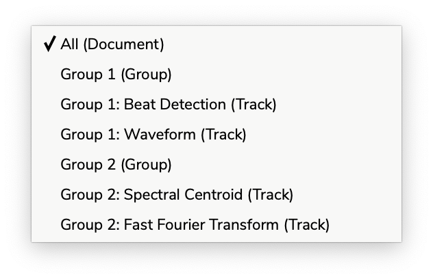
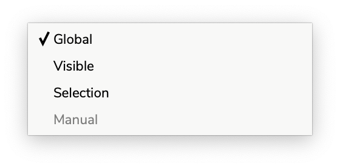
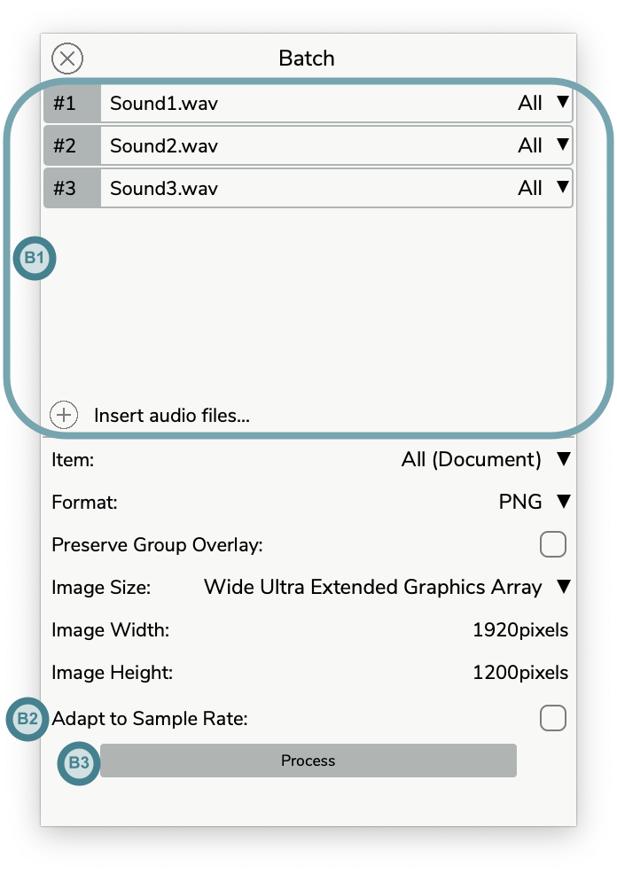
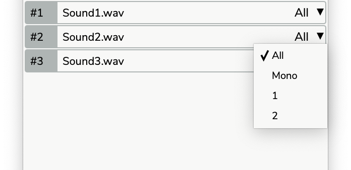
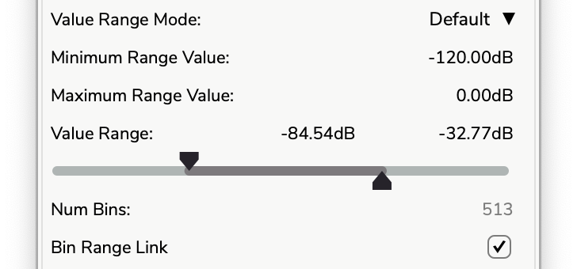

<h1 align="center">Partiels Manual</h1>

<p align="center">
<i>Version APPVERSION for Windows, Mac & Linux</i><br>
<i>Manual by Pierre Guillot</i><br>
<a href="https://www.ircam.fr">www.ircam.fr</a><br><br>


</p>

<div style="page-break-after: always;"></div>

## Table of contents

* [1. Introduction](#1-introduction)
  * [1.1. Main Features](#11-main-features)
  * [1.2. Third-party](#12-third-party)
  * [1.3. System requirements](#13-system-requirements)
  * [1.4. Versions and updates](#14-versions-and-updates)
  * [1.5. Feedback](#15-feedback)
  * [1.6. Credits](#16-credits)
* [2. Overview](#2-overview)
* [3. Manage documents](#3-manage-documents)
  * [3.1. Create and open](#31-create-and-open)
  * [3.2. Save and consolidate](#32-save-and-consolidate)
  * [3.3. Edition and backup](#33-edition-and-backup)
* [4. Create new tracks](#4-create-new-tracks)
  * [4.1. Analysis tracks](#41-analysis-tracks)
  * [4.2. File tracks](#42-file-tracks)
* [5. Organize the tracks by groups](#5-organize-the-tracks-by-groups)
  * [5.1. Edition](#51-edition)
  * [5.2. Layout](#52-layout)
* [6. Visualize and edit track results](#6-visualize-and-edit-track-results)
  * [6.1. Plot](#61-plot)
  * [6.2. Table](#62-table)
* [7. Export analyses](#7-export-analyses)
  * [7.1. General options](#71-general-options)
  * [7.2. Image options](#72-image-options)
  * [7.3. Text and binary options](#73-text-and-binary-options)
  * [7.4. Batch processing](#74-batch-processing)
* [8. View, navigation, and transport](#8-view-navigation-and-transport)
  * [8.1. View](#81-view)
  * [8.2. Navigation](#82-navigation)
  * [8.3. Transport](#83-transport)
  * [8.4. OSC](#84-osc)
* [9. Track properties](#9-track-properties)
  * [9.1. Processor](#91-processor)
  * [9.2. Graphical](#92-graphical)
  * [9.3. OSC](#93-osc)
  * [9.4. Plugin](#94-plugin)
* [10. Group properties](#10-group-properties)
* [11. Audio files layout](#11-audio-files-layout)
  * [11.1. Audio files information](#111-audio-files-information)
  * [11.2. Audio files configuration](#112-audio-files-configuration)
  * [11.3. Audio files recovery](#113-audio-files-recovery)
* [12. Audio settings](#12-audio-settings)
* [13. Plugins settings](#13-plugins-settings)
* [14. Graphic Preset](#14-graphic-preset)
* [15. Translations](#15-translations)
* [16. Command-line tools](#16-command-line-tools)

<div style="page-break-after: always;"></div>

## 1. Introduction

**[Partiels](https://github.com/Ircam-Partiels/partiels)** is a **digital audio file analysis application** for signal processing *researchers*, *musicologists*, *composers*, *sound designers*, etc., offering a dynamic interface for **exploring the content and characteristics of sounds**.

### 1.1. Main Features

Partiels allows **analysis** of one or several audio files using Vamp plugins **loading** data files, **visualizing**, **editing**, **organizing**, and **exporting** the results as images or text files that can be used in other applications such as Max, Pure Data, Open Music, etc.

- Versions for *Windows*, *Mac* & *Linux*  
- Multiformat & multichannel support  
- Multifile support (useful to compare audio files)  
- Analyzing audio with *Vamp* plugins  
- Visualizing results as *spectrogram*, *lines*, and *markers*  
- Drawing and editing results (copy/cut/paste/delete/duplicate/etc.)  
- Organizing and ordering analyses in groups  
- Exporting results to *PNG*, *JPEG*, *CSV*, *LAB*, *JSON*, *CUE* & *SDIF* file formats  
- Loading results from *CSV*, *LAB*, *JSON*, *CUE* & *SDIF* file formats  
- Converting results from *SDIF* to *JSON* file formats and inversely  
- Batch processing (useful to apply the same set of analyses on several audio files)  
- Command line interface to analyze, export and convert results  
- Consolidating documents (useful to share documents/analysis with other users across different platforms)  
- Audio playback with loop  

<p align="center"></p>

### 1.2. Third-party

Alongside [Partiels](https://github.com/Ircam-Partiels/partiels/releases/latest), a wide range of analyses based on audio engines developed at IRCAM and outside are ported to Vamp plugins. These plugins allow you to perform FFT, LPC, transient, fundamental, formant, tempo, speech-to-text, text-to-audio synchronisation and many other analyses. You can also find a large number of analysis plugins on the [Vamp plugins website](https://www.vamp-plugins.org/).

### 1.3. System Requirements

Partiels is compatible on MacOS 10.13 and higher (Universal 2 - Intel/Silicon), Windows 10 & 11, and Linux.

<p align="center"></p>

> ⚠️ Some Vamp plugins may not support the same configurations and may have other restrictions.

### 1.4. Versions and Updates

At startup, Partiels checks for the release of a new version on the project page. If a new version has been released, you can either go to the Partiels project page to download it, ignore this version (you will not be notified of the release of a new version), or ask to be reminded at the next startup.

If you don't want Partiels to check for a new release on startup, you can toggle the option via the main menu `Help → Automatic Check for New Version`. You can manually check for a new version release on the Partiels project page via the main menu `Help → Check for New Version`.

<p align="left">
<strong><a href="https://github.com/Ircam-Partiels/partiels/releases">👉 All versions of Partiels and the plugin collection</a></strong>
</p>

### 1.6. Feedback

For bug reports or feature requests, you can create an [issue](https://github.com/Ircam-Partiels/Partiels/issues) on this Github repository. For more general feedback and questions, you can create a [discussion](https://github.com/orgs/Ircam-Partiels/discussions) on this Github repository or on the [IRCAM forum](https://discussion.forum.ircam.fr/).

### 1.6. Credits

**[Partiels](https://github.com/Ircam-Partiels/partiels)**: Design, architecture and development by Pierre Guillot at IRCAM IMR department.
Contributions to development by Thomas Barbé and Nolan Dupont.  
Copyright 2025 IRCAM. All rights reserved.

#### Dependencies:
- **[Vamp SDK](https://github.com/vamp-plugins/vamp-plugin-sdk)** by Chris Cannam, copyright (c) 2005-2024 Chris Cannam and Centre for Digital Music, Queen Mary, University of London.
- **[Ircam Vamp Extension](https://github.com/Ircam-Partiels/ircam-vamp-extension)** by Pierre Guillot at IRCAM IMR department.  
- **[JUCE](https://juce.com/)** by Raw Material Software Limited.
- **[tinycolormap](https://github.com/yuki-koyama/tinycolormap)** by Yuki Koyama.
- **[JSON C++](https://github.com/nlohmann/json)** by Niels Lohmann.
- **[Magic Enum](https://github.com/Neargye/magic_enum)** by Daniil Goncharov.
- **[ASIO SDK](https://www.steinberg.net/developers/)** by Steinberg Media Technologies GmbH.

<div style="page-break-after: always;"></div>

## 2. Overview

Partiels has a main graphical interface to view, navigate and edit the different analyses of a document. The actions and interaction modes are presented in detail in the different sections of this manual.  

<p align="center"></p>

To begin the analysis and exploration of the sound, you must create or load a document as presented in the following section. 

You can display the Key Mappings panel that presents all the application's keyboard shortcuts via the main menu `Partiels → Key Mappings...` (Mac) or `Help → Key Mappings...` (Linux/Windows).

<p align="center"></p>

<div style="page-break-after: always;"></div>

## 3. Manage documents

A document is the main item you work on in Partiels. It contains a set of analysis tracks organized by groups. You can create, edit, save and load documents.

### 3.1. Create and open

When you open Partiels for the first time or create a new document via the main menu `File → New...` or with the keyboard shortcut `⌘ Cmd + N` (Mac) or `Ctrl + N` (Linux/Windows), the application presents the interface for starting a new document. 

<p align="center"></p>

You are prompted to load one or more audio files or pre-existing Partiels document file. The application supports audio file extensions *.aac*, *.aiff*, *.aif*, *.flac*, *.m4a*, *.mp3*, *.ogg*, *.wav* and *.wma*. A Partiels document file has the extension *.ptldoc*. You can use the file browser window by clicking on the `Load` button (**A1**) or drag the files directly into the interface (**A1**). You can also load a Partiels document file via the main menu `File → Open...` or with the keyboard shortcut `⌘ Cmd + O` (Mac) or `Ctrl + O` (Linux/Windows). And you can select one of the recently used Partiels documents from the list on the right (**A2**) or via the main menu `File → Open Recent`.

If you have loaded one or more audio files, a second interface prompts you to add a new analysis track by clicking on the `Add Track` button (**A4**) to display the analysis plugin loading window. Alternatively, you can also use a pre-existing Partiels document as a template. Click on the `Load Template` button (**A5**) to display the file browser window or select one of the recently used Partiels documents from the list on the right (**A6**).

<p align="center"></p>

You can define a default template to be used when loading an audio file using the drop-down menu (**A3**) or via the main menu `Partiels → Global Settings → Default Template` (Mac) or `Help → Global Settings → Default Template`.

You can also configure the quick export directory used for exporting frames with the keyboard shortcut via the main menu `Partiels → Global Settings → Quick Export Directory` (Mac) or `Help → Global Settings → Quick Export Directory` (Linux/Windows). The default quick export directory is the Desktop, but you can select any directory on your system.

If you use a Partiels document as a template, all the analyses in this document will be applied to the audio files you have selected. The *block size* and *step size* analysis parameters can be adapted automatically by activating the corresponding toggle button (**A7**) if the sample rate used in the initial document differs from that of your audio files.

If you add a new track with an analysis plugin, you can refer to the [corresponding section](#41-analysis-tracks) of this manual.

### 3.2. Save and consolidate

A document can be saved as a file with the extension *.ptldoc* on your system via the main menu `File → Save...` or with the keyboard shortcut `⌘ Cmd + S` (Mac) or `Ctrl + S` (Linux/Windows). You can also create a copy of the existing document (e.g. if you want to keep a version of the original document) via the main menu `File → Duplicate...` or with the keyboard shortcut `⌘ Cmd + ⇧ Shift + S` (Mac) or `Ctrl + ⇧ Shift + S` (Linux/Windows). 

A document file is a text file describing its contents, such as audio files, analysis tracks, organization by groups. Audio files and analysis files used in a document are not embedded directly in the text file but saved as absolute paths to the files. If you delete or move these files on your system, the application will not be able to load the data and run the analyses properly and will prompt you to find or replace them. 

If you want to ensure the consistency and permanence of a document or if you want to share it with other users, you can consolidate it via the main menu `File → Consolidate...` or with the keyboard shortcut `⌘ Cmd + ⇧ Shift + C` (Mac) or `Ctrl + ⇧ Shift + C` (Linux/Windows). This operation creates a folder with the name of the document followed by *ConsolidatedFiles*. It copies all the audio files into this folder next to the document and replaces the absolute paths of the document file with relative ones. All the results are also saved as binary files. You can then move and share the document with its attached folder, the analysis results can be loaded even if the analysis plugins are no longer available.

You can open the document file information panel by clicking on the corresponding [text button](#2-overview) (**K5**) on the main interface. 

<p align="center"></p>

This panel allows you to reveal the current document file in the file explorer of your operating system and to edit the description of the document. The description can be used to provide any information you deem useful: how to use the document, how to interpret the result, who created it, etc.

### 3.3. Edition and backup

Partiels allows you to control many elements of a document by adding tracks, organizing groups, changing the audio configuration, etc. All changes made to a document can be undone or redone over and over again using the action history. To undo an action, you can use the main menu `Edit → Undo` or with the keyboard shortcut `⌘ Cmd + Z` (Mac) or `Ctrl + Z` (Linux/Windows).  To redo an action, you can use the main menu `Edit → Redo` or with the keyboard shortcut `⌘ Cmd + ⇧ Shift + Z` (Mac) or `Ctrl + ⇧ Shift + Z` (Linux/Windows). 

With each action, Partiels temporarily saves the current state of the document and if for some (unlikely) reason the application crashes. Upon reopening, Partiels will allow you to restore the document you were working on just before the crash.  

<div style="page-break-after: always;"></div>

## 4. Create new tracks

A track contains and displays data from a sound analysis. This data can be of three different types, each with its own representation:

<p align="center"></p>

- Matrix: A time point with a duration, and a vector of numerical values (e.g. the data generated by an FFT analysis). Matrices are represented by an image where the horizontal axis corresponds to time, the vertical axis to a vector and the color varies according to the numerical value of the elements of the vector (**1**). 
- Marker: A time point with a duration, and potentially a text label (e.g. data generated by a transient detection). Each marker is represented by a vertical line whose horizontal position depends on the time and thickness of the duration with potentially the adjacent label text (**2**). 
- Point: a time point with a duration, and potentially a numerical value (e.g. the data generated by an estimation of the fundamental frequency). The points define segments whose horizontal position depends on the time and vertical position depends on the numerical value. A point with a non-zero duration defines a horizontal line whose length depends on the duration. A point without numerical value stops the succession of segments (**3**).  

Tracks can be created in two ways, from the analysis of a Vamp plugin or from a result file.

### 4.1. Analysis tracks

When you click on the button to add analysis tracks via the interface for starting a new document, the panel for adding analysis plugins is displayed. If you are already working on a document, you can show or hide this window via the main menu `Edit → Show/Hide New Track Panel`, the keyboard shortcut `⌘ Cmd + T` (Mac) or `Ctrl + T` (Linux/Windows), or with the arrow button ([Overview](#2-overview) - **K9**) on the main interface. All plugins installed on your computer are listed in the interface, followed by the plugins available on internet as listed on [https://www.vamp-plugins.org/](https://www.vamp-plugins.org/). 

<p></p> 

You can also search for specific plugins by clicking on the text filter entry (**P1**) or by using the keyboard shortcut `⌘ Cmd + F` (Mac) or `Ctrl + F` (Linux/Windows), then typing the keyword corresponding to the plugins you wish to display (e.g. *tempo* or *spectrogram* for the feature or *ircam* for the manufacturer). 

> 💡 **Tip**: Click on the Ircam icon (**P2**) to filter only Ircam plugins.

Information on the selected plugin is displayed in the section at the bottom of the panel (**P3**). The installed plugins display their name, feature, maker, version, category, and description. The plugins available on internet display their name, maker, description and a button to access the download website.

You can select one or more installed plugins and then press the `Return ⏎` key (or you can simply double click on a plugin) to add a new track for each plugin in your document (**P4**). If you are working on a new blank document, a default group is automatically created in which your new tracks appear. If you are working on a document that already contains groups and tracks, the new tracks are inserted after the last selected track or in the last selected group.

> For further information about the plugin management, please refer to the [Plug-ins settings](#13-plugins-settings) section.

> 💡 **Tip**: Click on the settings button (**P5**) to open the plugins settings panel.

<br clear="left"/>

If you want to modify the analysis and graphical properties of a track, please refer to the [Track properties](#9-track-properties) section.

### 4.2. File tracks

A new track can be created by importing pre-calculated results from a file. This file can be generated from another Partiels document to avoid recalculating the analyses or from another application. The supported formats are JSON (*.json*), CSV (*.csv*), LAB (*.lab*), CUE (*.cue*) and SDIF (*.sdif*). You can bring up the file browser to select a file via the main menu `File → Import...` or with the keyboard shortcut `⌘ Cmd + ⇧ Shift + I` (Mac) or `Ctrl + ⇧ Shift + I` (Linux/Windows). 

If you're importing a file in CSV format, the application will automatically try to determine the separator character between each column (*Comma*, *Space*, *Tab*, *Pipe*, *Slash*, *Colon*). The Reaper-specific CSV format is also automatically detected and supported. If the application fails to automatically determine the separator, the `Load File...` window appears, allowing you to select the separator character. 

<p align="center">

</p>

When importing markers in CSV format, it is recommended to escape the tags (with single or double quotes for example) to ensure that the numeric values of the labels are considered as text.

> 💡 **Tip**: If you wish to import labels from Audacity, simply change the .txt extension to .lab.

If you are importing a file in SDIF format, the `Load File...` window appears allowing you to define the frame code, matrix code, row and column to import.

<p align="center">

</p>

> 💡 **Tip**: Fundamental frequency analysis files with a 1FQ0 matrix signature are parsed automatically.

If you are importing a file in JSON format containing an extra description of the track, the information is used to define the default graphical parameters and to give you the possibility to run the analysis using the original plugin if necessary.

If you are working on a new blank document, a default group is automatically created in which your new tracks appear. If you are working on a document that already contains groups and tracks, the new tracks are inserted after the last selected track or in the last selected group.

<div style="page-break-after: always;"></div>

## 5. Organize the tracks by groups

The analyses of a document are represented by tracks. These analysis tracks are organized in groups. Each group can contain several tracks, allowing the analysis representations to be superimposed. In a group, the tracks are superimposed from bottom to top. 

<p align="center">

</p>

It is therefore often preferable to place matrix type analyses, such as a sonogram, at the bottom and point or marker type analyses, such as spectral centroid or transient detection, on top. Thus the lines and markers will be displayed over the matrices.

### 5.1. Edition

Move tracks and groups by clicking on the track or group header to select it and then dragging the item to the desired location. In this way you can reorder tracks within a group, move a track within another group and reorder groups between themselves. 

<p align="center">

</p>

Use the keyboard modifier `Ctrl` during the move action of the selected track or group to duplicate it and move the copy of the item to the desired location.

> 💡 **Tip**: Selecting a track or a group with the keyboard modifier `Ctrl` without moving it allows you to quickly create a copy of the item that will be placed just above it. Then you can modify the analysis parameters of the copy to compare the results, for example.

Select a group or track by clicking on the item's header (or multiple tracks in a group by using the keyboard modifier `⇧ Shift`), then use the keyboard shortcuts `⌦ Delete` or `⌫ Backspace` to delete it.

Use the main menu `Edit → Add New Group`, the keyboard shortcuts `⌘ Cmd + G` (Mac) or `Ctrl + G` (Linux/Windows), or the drop-down menu of the `+` button ([Overview](#2-overview) - **K1**) on the main interface to create a new group that will be inserted after the last selected item.

### 5.2. Layout

Use the button (**K1**) on the header of a group to expand the group and show all the tracks of the group (e.g., *Group 2*) or conversely, to shrink the group and hide all the tracks of the group (e.g., *Group 1*). Use the button (**K2**) to expand or shrink all the groups in the document.

<p align="center">

</p>

The height of tracks and groups is variable and depends on two modes, free (default) or constrained. Click on the button (**K3**) to toggle the constrained mode. Click and drag on the bottom border of tracks and groups to resize them (**K4**). 

In constrained mode, the height of tracks and groups will adapt perfectly to the height of the main window, so that all groups and tracks are always visible. You can, however, modify their respective heights, in order to enlarge a track or group relative to other elements, while preserving an overall size corresponding to the size of the main window.

In free mode, the height of tracks and groups is not constrained by the size of the main window. If the overall cumulative height of groups and tracks exceeds the height of the main window, some groups and tracks may be hidden. Use the vertical scroll mouse over their header or the scroll bar at the right of the interface to move the view and display the hidden groups and tracks.

> 💡 **Tip**: You can optimize the height of tracks and groups to the height of the main window by clicking the button (**K3**) with the keyboard modifier `⇧ Shift`.

Use the `⇥ Tab` key to move the selection to the next visible track or group. 

<div style="page-break-after: always;"></div>

## 6. Visualize and edit track results

Track results can be manually edited directly on the graphical plot of the track or the group or using the result table to correct values and improve representation. Only marker or point tracks can be edited. 

Following editing, you can use the keyboard shortcuts `⌘ Cmd + Z` (Mac) or `Ctrl + Z` (Linux/Windows) to restore previous states, and `⌘ Cmd + Y` (Mac) or `Ctrl + Y` (Linux/Windows) or `⌘ Cmd + ⇧ Shift + Z` (Mac) or `Ctrl + ⇧ Shift + Z` (Linux/Windows) to reapply changes to both the graphical plot and the results table.

### 6.1. Plot

On the graphical plot, markers are represented by vertical lines on the timeline, points by a succession of segments - which can be interrupted - and vectors by a sonogram-like matrix.  Markers and points can be created, deleted, copied, pasted, and duplicated. Markers can also be moved over time.

Interactions on a group's graphical plot modify the results of the group's reference track. The reference track can be accessed via the group's properties window or via the popup menu displayed by right-clicking on the graphical plot.

Editing actions with the mouse require drawing mode:

- Click with `⌘ Cmd` (Mac) or `Ctrl` (Linux/Windows) on a marker track to create a new marker at the corresponding time.  
- Click on a marker and drag it to move it to the desired time.
- Click and drag with `⌘ Cmd` (Mac) or `Ctrl` (Linux/Windows) on a point track to create new points at the corresponding times and values. 

> 💡 **Tip**: Toggle between navigation mode and drawing mode with the edit button ([Overview](#2-overview) **Ka**), the main menu `Frame → Toggle Drawing mode`, or using the keyboard shortcuts `⌘ Cmd + E` (Mac) or `Ctrl + E` (Linux/Windows).

Other editing actions can be performed at any time:

- Press the `Delete ⌫` key to delete markers or points within the selected time range and on selected tracks and channels.
- Use the keyboard shortcut `⌘ Cmd + C` (Mac) or `Ctrl + C` (Linux/Windows) to copy markers or points in the selected time range and on selected tracks and channels to the clipboard.
- Use the keyboard shortcut `⌘ Cmd + X` (Mac) or `Ctrl + X` (Linux/Windows) to cut markers or points in the selected time range and on selected tracks and channels to the clipboard.
- Use the keyboard shortcut `⌘ Cmd + V` (Mac) or `Ctrl + V` (Linux/Windows) to paste markers or points saved in the clipboard at the playhead position.
- Use the keyboard shortcut `⌘ Cmd + D` (Mac) or `Ctrl + D` (Linux/Windows) to duplicate markers or points in the selected time range and on selected tracks and channels at the end of the selected time range.
- Use the keyboard shortcut `i` to insert markers or points at the playhead position (if the playback is running) or at the start and end of the selected time range (if the playback is not running). 
- Use the keyboard shortcut `b` to insert a point with no value (to break the continuity of the segments) at the playhead position (if the playback is running) or at the start of the selected time range (if the playback is not running). 
- Double-click on a marker to display the results table, focusing on the selected element.

> 💡 **Tip**: You can edit the selected tracks and groups via the main menu `Frame → Export Frame(s) to [Directory]` or `Frame → Export Frame(s) To...` to choose a custom destination, or by right-clicking on the group or track plots to display the popup menu.

### 6.2. Table

The results table displays data in three columns, the first corresponding to time, the second to duration, and the third to the label for markers, the numerical value for points, and the list of values for vectors. Markers and points can be deleted, copied, pasted, and duplicated. The time, duration, label, or value of markers and points can be edited.

- Click on a cell to edit the time, duration, label or value of a point or marker.
- Press the `Delete ⌫` key to delete markers or points of the selected rows.
- Use the keyboard shortcut `⌘ Cmd + C` (Mac) or `Ctrl + C` (Linux/Windows) to copy markers or points of the selected rows to the clipboard.
- Use the keyboard shortcut `⌘ Cmd + X` (Mac) or `Ctrl + X` (Linux/Windows) to cut markers or points of the selected rows to the clipboard.
- Use the keyboard shortcut `⌘ Cmd + V` (Mac) or `Ctrl + V` (Linux/Windows) to paste markers or points saved in the clipboard at the start of the selected rows.
- Use the keyboard shortcut `⌘ Cmd + D` (Mac) or `Ctrl + D` (Linux/Windows) to duplicate markers or points of the selected rows.

<div style="page-break-after: always;"></div>

## 7. Export analyses

The results of the analyses of a document can be exported in different formats, as an image, text or binary file. You can display the export window via the main menu `File → Export...` or with the keyboard shortcut `⌘ Cmd + ⇧ Shift + E` (Mac) or `Ctrl + ⇧ Shift + E` (Linux/Windows). This window allows you to select the analysis(es) to be exported, define the time range, the format and the options for this format. 

<p align="center">

</p>

Once you have selected the desired configuration, click on the `Export` button (**E5**), you will be prompted to select an output file or a folder if you are exporting several analyses in separate files (the name of the files will be generated automatically with the name of the group and the track).

> 💡 **Tip**: You can export the selected tracks and groups to the quick export directory according to the last configuration used via the main menu `Frame → Export Frame(s) to [Directory]`, by right-clicking on the group or track plots to display the popup menu, or by using the `⎇ Option + E` (Mac) or `Alt + E` (Linux/Windows). You can also choose a custom destination using `Frame → Export Frame(s) To...` or by using the `⌘ Command + ⎇ Option + E` (Mac) or `Ctrl + Alt + E` (Linux/Windows). The quick export directory can be configured via the main menu `Partiels → Global Settings → Quick Export Directory` (Mac) or `Help → Global Settings → Quick Export Directory` (Linux/Windows), and defaults to the Desktop.

### 7.1. General options

The `Item` menu (**E1**) allows you to select which items to export. When you click on the menu, a popup displays all available items with checkboxes:

- **All (Document)**: Selects or deselects all compatible groups and tracks in the document
- **Group entries**: Selectable (with checkboxes) only when using image formats (JPEG/PNG). For other formats, groups act as shortcuts to select all compatible tracks within the group
- **Track entries**: Selectable only if they are compatible with the chosen export format

The menu adapts dynamically based on the selected format:
- Image formats (JPEG, PNG): Both groups and tracks are selectable
- Text formats (CSV, JSON, LAB, etc.): Only tracks compatible with the format are selectable
- Special formats (CUE, Reaper): Only tracks containing label data are selectable

When multiple items are selected, the menu displays **"Multiple Items"**. When a single item is selected, it displays the item name (e.g., "Group1: Track1 (Track)"). This allows you to export specific subsets of tracks within groups, providing more flexibility than the previous single-selection approach. 

<p align="center">

</p>

The four time range options (**E2**) allow you to define the time range to be exported. 

The `Time Preset` drop-down menu allows you to select one of three presets: *Global* to export the entire time range of the document, *Visible* to export the time range visible on the screen, and *Selection* to export the time range corresponding to the current selection. 

<p align="center">

</p>

You can also define the time range with the text entries `Time Start`, `Time End`, and `Time Length`, the preset then automatically switches to *Manual* mode. 

<p align="center">

</p>

The `Format` drop-down menu (**E3**) allows you to select the output format. This can be an image format *JPEG* or *PNG* , a text format *JSON*, *CSV*, *LAB*, *CUE*, *REAPER*, or a binary format *SDIF*. For each format, you can set specific options (**E4**).

### 7.2. Image options

Exporting to an image format (*JPEG* or *PNG*) offers two rendering options:

The `Preserve Group Overlay` button toggles the preservation of the group overlay display if you are exporting the entire document or a group (so this option is not available when exporting a single track). Each group will be exported as an image including all its tracks. If the option is disabled, each track will be exported separately.

<p align="center">

</p>

The `Image Size` dropdown menu offers presets to control the size of the image. If the *Current Size(s)* item is selected, the export mechanism uses the current visible sizes and resolution of the tracks and groups. The *Manual* item is selected if the width and height of the image are defined manually and don't match one of the presets.

The `Image Width`, `Image Height`, `Image PPI` number fields can be used to manually define the width and the height of the images in pixels and the resolution in pixels per inch.

The `Outside Grid` dropdown menu allows you to select the image borders that should contain the graduations and labels of the grids located outside the main frame for the horizontal (time) and vertical ranges.  

### 7.3. Text and binary options

The `Apply Extra Thresholds` button offers an option to filter exported results based on extra threshold values configured in the track properties. When enabled, only analysis results that meet all configured threshold criteria will be included in the exported file. This option is available for CSV, JSON, LAB, CUE, Reaper, and Pure Data formats but not for SDIF format. This feature is particularly useful for exporting only high-confidence analysis results by filtering out data points that fall below specified threshold values.

> 💡 **Note**: The "Ignore Matrix Tracks" option is no longer available in the graphical interface. With the new multi-selection system, you can now selectively choose which tracks to export, including or excluding matrix tracks (such as spectrograms) as needed. The option remains available via the command line interface for batch processing scenarios.

Export to CSV format offers two options:
- `Include Header Row` enables the writing of a header line including the titles of the columns (e.g. *time*, *duration*, *label*).
- `Column Separator` allows to define the separator character between each column: *Comma* (default), *Space*, *Tab*, *Pipe*, *Slash*, *Colon*. This can facilitate the parsing of files in other applications. 
- `Disable Label Escaping` disables the automatic escaping of special characters in labels (quotes, separators). This option is also available for the LAB format.

Export to Lab format corresponds to the CSV format with the end time used instead of the duration. Two additional options are available:
- `Lab Separator` allows you to define the separator character for the Lab format: *Comma*, *Space* (default), *Tab*, *Pipe*, *Slash*, *Colon*.
- `Disable Label Escaping` disables the automatic escaping of special characters in labels (quotes, separators).

Export in Reaper format corresponds to the CSV format supported by the application, with an option for markers or regions.

Export in Pure Data format corresponds to the CSV format with space character as separator, semicolon as linebreak and no label escaping. This format facilitates the compatibility with the Pure Data text object.

Export in Max format corresponds to the CSV format with space character as separator and line indices prepended to each line. This format facilitates the compatibility with the Max coll object.

Export to JSON format offers one option:
- `Include Extra Description` enables writing a JSON object after the results containing all the properties of the audio processor for analysis and graphical rendering of the track. This allows to automatically optimize the display of the analysis but also to restart the analysis if needed.

Export to SDIF format offers three options:
- `Frame Signature` defines the frame signature to encode the results in the SDIF file. 
- `Matrix Signature` defines the matrix signature to encode the results in the SDIF file. 
- `Column Name` defines the name of the column to encode the results in the SDIF file.

### 7.4. Batch processing

You can use the current document as a template to generate results for other audio files using the batch processing system. To do this, open the batch window via the main menu `File → Batch...` or with the keyboard shortcut `⌘ Cmd + ⇧ Shift + B` (Mac) or `Ctrl + ⇧ Shift + B` (Linux/Windows). 

<p align="center">

</p>

This window top section (**B1**) allows you to select audio files and configure their channels layout.

- Add items: Click on the `+` button to select one or several files using the file browser window or drag and drop one or several audio files or a folder from the operating system's file browser. A new item is created for each audio file. 

- Delete items: Select one or several items (with the `Ctrl` or `⇧ Shift` keys) by clicking on the name part of the item and press the `Delete ⌫` key to remove items from the audio files layout.

- Move an item: Click on the `#` index part of the item, drag the item to a new position above or below and drop the item to reorder the audio file configuration and update the indices.
<p align="center">

</p>

- Copy an item: Click on the `#` index part of the item with the `Ctrl` key pressed to duplicate an item, then drag and drop to insert the new item at the desired position.

- Modify an item's channels: Click on the channel drop-down menu and select the desired configuration (*all* analyzes all channels separately, *mono* sums all channels into one channel).  
<p align="center">

</p>

- Undo changes: Use the undo key command `⌘ Cmd + Z` (Mac) or `Ctrl + Z` (Linux/Windows) to restore previous states. Note the undo/redo mechanism is relative to this panel only (until the changes are applied to the document).

- Redo changes: Use the redo key commands `⌘ Cmd + Y` (Mac) or `Ctrl + Y` (Linux/Windows) or `⌘ Cmd + ⇧ Shift + Z` (Mac) or `Ctrl + ⇧ Shift + Z` (Linux/Windows) to reapply changes. Note the undo/redo mechanism is relative to this panel only (until the changes are applied to the document).

`Adapt to Sample Rate` (**B2**) enables the adaptation of the *block size* and *step size* analysis parameters if the sample rate used in the current document differs from that of the audio files.

Once you have selected the desired configuration, click on the `Process` button (**B3**), you will be prompted to select a folder (the name of the files will be generated automatically with the name of the audio files, the groups and the tracks).

<div style="page-break-after: always;"></div>

## 8. View, navigation, and transport

This section covers aspects related to visualization, navigation, and audio playback in the application.

You can change the general theme of the application via the `View → Theme` menu. By default, the automatic mode adapts to your operating system's theme changes (light and dark).

Modify the global scale of the application via the `View → Scale` menu to enlarge the overall view of the application.

Enable or disable the magnetize option by clicking the `Magnetize` button in the main interface ([Overview](#2-overview) - **K6**) or using the main menu `Transport → Toggle Magnetize`. When the magnetize option is enabled, the position snaps to the nearest markers of the selected channels in the document.

### 8.1. View

Each track and group offers two representations of analysis results. The main representation shows the results over time ([Overview](#2-overview) **V2**) as vertical lines for markers, points (connected into segments) for values, and images for matrices. The secondary display shows an instantaneous value of the results at the playhead position ([Overview](#2-overview) **V1**).

- Enable the info bubble window with the `Info Bubble` button ([Overview](#2-overview) **K7**), via the main menu `View → Info Bubble` or the keyboard shortcut `⌘ Cmd + I` (Mac) or `Ctrl + I` (Linux/Windows) to display the values of the analysis results when hovering over these representations with the mouse.

- Change the display of track and group grids with the `Grid` button ([Overview](#2-overview) **K8**): hidden, ticks, or full.

### 8.2. Navigation

Partiels offers the ability to navigate and zoom on the horizontal axis corresponding to the time range, and on the vertical axis corresponding to the value (or frequency) range.

Click and drag without modifiers on a track or group to select a time range. If the magnetize option is enabled, the position snaps to the nearest marker. The time selection can be visualized and modified with the time fields in the header of the main interface ([Overview](#2-overview) - **N**).

#### 8.2.1 Horizontal  

The main interface contains a horizontal ruler and a horizontal bar ([Overview](#2-overview) **Z1** and **Z2**) to control time zoom. You can also use mouse and trackpad interactions or keyboard shortcuts to navigate and zoom.

- Click and drag on the horizontal ruler ([Overview](#2-overview) **Z1**) to zoom in and out and to move the time range forward and backward.
- Click with `⇧ Shift` and drag left and right on the horizontal ruler ([Overview](#2-overview) **Z1**) to move the time range forward and backward.
- Click with `Alt` and drag up and down on the horizontal ruler ([Overview](#2-overview) **Z1**) to zoom out and in on the time range.
- Click with `⌘ Cmd` (Mac) or `Ctrl` (Linux/Windows) and drag on the horizontal ruler ([Overview](#2-overview) **Z1**) to select a time range to zoom in on.
- Right-click or click with `Ctrl` (Mac) on the horizontal ruler ([Overview](#2-overview) **Z1**) to display a floating window that allows you to textually specify the zoom range.
- Double-click on the horizontal ruler ([Overview](#2-overview) **Z1**) to zoom out to the entire time range.
- Click on the horizontal bar ([Overview](#2-overview) **Z2**) to move the time range forward and backward.
- Double-click on the horizontal ruler ([Overview](#2-overview) **Z1**) to reset the time zoom to the global time range.
- Scroll vertically with `⇧ Shift` (or horizontally) using the mouse wheel to move the time range forward and backward.
- Scroll vertically using the mouse wheel to zoom in and out on the time range.
- Use pinch zoom to zoom in and out on the time range.
- Zoom in with the keyboard shortcut `⌘ Cmd + +` (Mac) or `Ctrl + =` (Linux/Windows) or via the main menu `View → Time Zoom In`.
- Zoom out with the keyboard shortcut `⌘ Cmd + -` (Mac) or `Ctrl + -` (Linux/Windows) or via the main menu `View → Time Zoom Out`.

> 💡 **Tip**: During time zooming, the anchor point can correspond to the mouse position or the playhead starting position. You can change the mode via the menu `View → Anchor Time Zoom on Playhead`.

#### 8.2.2 Vertical

The interface of each point or matrix track contains a vertical ruler for each channel and a vertical bar for all channels ([Overview](#2-overview) **Z3** and **Z4**) to control value (or frequency) zooms. Marker tracks do not have vertical zoom. The corresponding rulers and bars also appear on groups using the frontmost track of the groups with vertical zoom capability. You can also use mouse and trackpad interactions or keyboard shortcuts to navigate and zoom.

- Click and drag on the vertical ruler ([Overview](#2-overview) **Z3**) to zoom in and out and to move the value or frequency range up and down.
- Click with `⇧ Shift` and drag up and down on the vertical ruler ([Overview](#2-overview) **Z3**) to move the value or frequency range up and down.
- Click with `Alt` and drag left and right on the vertical ruler ([Overview](#2-overview) **Z3**) to zoom out and in on the value or frequency range.
- Click with `⌘ Cmd` (Mac) or `Ctrl` (Linux/Windows) and drag on the vertical ruler ([Overview](#2-overview) **Z3**) to select a value or frequency range to zoom in on.
- Right-click or click with `Ctrl` (Mac) on the vertical ruler ([Overview](#2-overview) **Z3**) to display a floating window that allows you to textually specify the zoom range.
- Double-click on the vertical ruler ([Overview](#2-overview) **Z3**) to zoom out to the entire value or frequency range.
- Click on the vertical bar ([Overview](#2-overview) **Z4**) to move the value or frequency range up and down.
- Scroll vertically or horizontally with `Ctrl` using the mouse wheel to zoom in and out on the value or frequency range.
- Scroll vertically with `Ctrl` and `⇧ Shift` using the mouse wheel to move the value or frequency range up and down.
- Use pinch zoom with `Ctrl` to zoom in and out on the value or frequency range.
- Zoom in with the keyboard shortcut `⌘ Cmd + ⇧ Shift + +` (Mac) or `Ctrl + ⇧ Shift + =` (Linux/Windows) or via the main menu `View → Vertical Time Zoom In`.
- Zoom out with the keyboard shortcut `⌘ Cmd + ⇧ Shift + -` (Mac) or `Ctrl + ⇧ Shift + -` (Linux/Windows) or via the main menu `View → Vertical Time Zoom Out`.

#### 8.2.3 Plot

When navigation mode is enabled, the group and track plots allow navigating and zooming horizontally and vertically.

- Click with `⌘ Cmd` (Mac) or `Ctrl` (Linux/Windows) and drag to select the time and value ranges to zoom in on.
- Click with `⎇ Option` (Mac) or `Alt` (Linux/Windows) and drag from the top left to the bottom right corner to zoom in on the time and value ranges, and conversely, from the bottom right to the top left corner to zoom out on the time and value ranges.
- Click with `⇧ Shift` and drag to move the time and value ranges forward and backward.
- Double-click with `⇧ Shift`, `⌘ Cmd` (Mac) or `Ctrl` (Linux/Windows) or `⎇ Option` (Mac) or `Alt` (Linux/Windows) to zoom out to the entire time and value ranges.

> 💡 **Tip**: Toggle between navigation mode and drawing mode with the edit button ([Overview](#2-overview) **Ka**), the main menu `Frame → Toggle Drawing mode`, or using the keyboard shortcuts `⌘ Cmd + E` (Mac) or `Ctrl + E` (Linux/Windows).

### 8.3. Transport

Partiels offers basic audio playback features allowing you to listen to audio files while viewing the analysis results. Audio playback can be controlled with the transport interface ([Overview](#2-overview) **T**) at the center of the main interface header.

<p align="center">

</p>

Actions for moving the playhead starting position and controlling the playback loop depend on the magnetize option which locks positions to markers of the analysis tracks.

- Enable/disable audio playback: Click the play button (**T1**), use the main menu `Transport → Toggle Playback` or the space bar `⎵` to start or stop audio playback at the playhead starting position.
- Enable/disable audio loop: Click the loop button (**T2**), use the main menu `Transport → Toggle Loop` or the keyboard shortcut `⌘ Cmd + L` (Mac) or `Ctrl + L` (Linux/Windows) to enable or disable audio loop.
- Control the loop range: Use the loop bar (**T4**) to control the loop range. If the magnetize option is enabled, positions snap to the nearest markers.
  - Click on the borders of the existing loop range without any keyboard modifier and drag to resize the start or end of the loop range.
  - Click and drag anywhere else without any keyboard modifier to select a new loop range.
  - Click and drag with `⇧ Shift` on the loop range to move the loop range over time.
  - Double-click on the loop bar to select the range between the two closest markers (or the global range when there is no marker).
  - Double-click with `⌘` (Mac) or `Ctrl` (Linux/Windows) on the loop bar to select the global range.
- Automatically stop playback at the end of the loop: Use the main menu `Transport → Toggle Stop Playback at Loop End` to enable or disable the option.
- Rewind the playhead: Click the rewind button (**T3**), use the main menu `Transport → Rewind Playhead` or the keyboard shortcut `⌘ Cmd + W` (Mac) or `Ctrl + W` (Linux/Windows) to move the playhead to the beginning of the audio files or to the beginning of the playback loop if the loop is enabled.
- Move the playhead backward: Use the main menu `Transport → Move the Playhead Backward` or the keyboard shortcut `⌘ Cmd + ←` (Mac) or `Ctrl + ←` (Linux/Windows) to move the playhead to the previous marker when the magnetize option is enabled.
- Move the playhead forward: Use the main menu `Transport → Move the Playhead Forward` or the keyboard shortcut `⌘ Cmd + →` (Mac) or `Ctrl + →` (Linux/Windows) to move the playhead to the next marker when the magnetize option is enabled.
- Set the playhead position: Use the time field (**T6**) when playback is stopped to set the playhead starting position. When playback is started, the time field displays the running playhead position. Click on an analysis to move the playhead starting position to the corresponding time position. If the magnetize option is enabled, the position snaps to the nearest marker.
- Control the volume: Click and drag the volume slider (**T7**) to control the audio output volume.

> 💡 **Tip**: See these sections to configure the [audio files layout](#11-audio-files-layout) and [audio settings](#12-audio-settings).

### 8.4. OSC

Partiels offers the possibility to send track analysis values via OSC (Open Sound Control) during playback or when hovering over tracks and groups with the mouse using the keyboard modifier `⎇ Option` (Mac) or `Alt` (Linux/Windows). The information can be retrieved by other applications (such as Pure Data, Live, Reaper, etc.) for real-time sonification of the results.

The host connection is configured via the OSC properties panel, accessible via the menu `Partiels → OSC Settings...` (Mac) or `Help → OSC Settings...` (Linux/Windows), or by clicking on the OSC button ([Overview](#2-overview) **O**) at the center of the main interface header (when OSC is connected, the button turns green).

<p align="center">

</p>

To allow the sending of a track's results via OSC, the corresponding option must be enabled in the [track properties](#93-osc).

To ensure compatibility with the maximum number of applications, results are sent as messages (not bundles).

When playback starts and stops, the OSC messages `playback 1` and `playback 0` are sent. During playback, OSC messages are sent each time the playhead advances. For each channel of each track with OSC enabled, a message corresponding to the result with time greater than or equal to the playback time is sent:

1. Track address (string)
2. Channel index (int)
3. Result index (int)
4. Playback time (float)
5. Result time (float)
6. Result duration (float)
7. Result values:
    - Character string for a marker (string)
    - Numerical value for a value (float) or label "-" for a break (string)
    - Size (int) and list of numbers (float) for a vector
8. List of numbers (float) for additional values

When playback is paused, information is sent when you hover over groups and tracks with the mouse and the keyboard modifier `⎇ Option` (Mac) or `Alt` (Linux/Windows). The OSC messages `mouseover 1` and `mouseover 0` are sent when message sending starts or stops. With each mouse movement, and for each track under the cursor, a message containing the results is sent with the address corresponding to the track ID followed by:

1. Track address (string)
2. Channel index (int)
3. Result index (int)
4. Playback time (float)
5. Result time (float)
6. Result duration (float)
7. Result values:
    - Character string for a marker (string)
    - Numerical value for a value (float) or label "-" for a break (string)
    - Bin index (int) and bin value (float) for a vector
8. List of numbers (float) for additional values

Track zoom information and additional value thresholds are also sent when they are modified, allowing synchronization of Partiels' graphical representation with the graphical representation or audio engine controlled by OSC.

Zoom information is sent only for point-type tracks (value zoom) and matrix-type tracks (value and bin zooms):

1. Track OSC identifier (string)
2. "zoom" (string)
3. Zoom type (string - value or bin)
4. Global range - start (float)
5. Global range - end (float)
6. Visible range - start (float)
7. Visible range - end (float)

Additional value thresholds are sent only for tracks with additional values:

1. Track OSC identifier (string)
2. "thresholds" (string)
3. List of numbers (float) for additional values

> 💡 **Tip**: A series of Pure Data and Max patches offering alternative visualization of the results is distributed with the application.

<div style="page-break-after: always;"></div>

## 9. Track properties

The track properties panel allows you to access information about a track and modify the processor and graphical properties. You can display a track's properties panel by clicking on the corresponding button in the track header ([Overview](#2-overview) - **K2**), the corresponding entry in the dropdown menu displayed by the properties button of the header of the group containing the track ([Overview](#2-overview) - **K3**) or using the keyboard shortcut `⌘ + ⎇ Option + P` (Mac) or `Ctrl + Alt + P` (Linux/Windows).

<p align="center">

</p>

The first property of a track is its name. The default name of the track corresponds either to the name of the analysis plugin if a plugin was used to create the track, or to the name of the results file if a results file was used to create the track. The track name can be modified using the corresponding text field. The properties of a track are then organized into four categories: processor, graphical, osc, plugin.

### 9.1. Processor

The processor section allows you to modify all the properties that control the analysis engine or result file loading for the track. Thus, the properties are related to the result file, the plugin parameters, and the state of the track.

#### 9.1.1. File

The result file information is displayed if the analysis results were loaded from a file. Note that if the analysis results were loaded from a JSON file containing information about the plugin or from a file resulting from the consolidated track, the processor parameters may still be accessible and used to update the analysis results.

<p align="center">

</p>

- The result file can be revealed in the operating system's file explorer by clicking on the text button.

- The result file can be detached from the track (only if the track contains information about the plugin) by clicking on the text button with the `shift` keys pressed. In this case, the track will use the plugin information to run the analysis and produce new results.

#### 9.1.2. Parameters 

Depending on the plugin characteristics, the section provides access to the default plugin parameters. If the plugin expects a frequency domain input signal, the section gives access to the window type, block size, and step size in order to transform the time domain signal into a frequency domain signal with a Fast Fourier Transform. Otherwise, if the plugin expects a time domain input signal, the section gives access to the block type if the plugin has no preferred block size, to the step size if the plugin has no preferred step size or doesn't expect the step size to be equal to the block size.

<p align="center">

</p>

- Window Type: The FFT windowing function to transform the time domain signal into a frequency domain signal if the plugin expects a frequency domain input signal.

- Block Size: The size of the FFT window to transform the time domain signal into a frequency domain signal if the plugin expects frequency domain input data, or the size of the blocks of samples if the plugin expects a time domain input signal.

- Step Size: The FFT step size to transform the time domain signal into a frequency domain signal if the plugin expects a signal in the frequency domain, or the size between each block of samples if the plugin expects a time domain input signal.

<p align="center">

</p>

- Input Track: The input track property allows you to use another document analysis track as the input for the current analysis track. To do this, the analysis plugin must allow it, and the input data type must match the data type expected by the plugin. Changing the input track or changing the results of this track automatically triggers a new analysis of the current track.

The section provides access to the plugin-specific parameters that are used to perform the analysis. According to their specifications, parameter values can be controlled by a toggle button (on/off), a number field (integer or floating-point values), or a dropdown menu (list of items). Modifying the parameters triggers the analysis and produces new results. If the track is loaded from a file or if the analysis results have been modified, the application displays a dialog window warning you that the file will be detached from the track before performing the analysis and asking if you wish to continue (you can always cancel the operation to recover the previous analysis results).

#### 9.1.3. Preset

<p align="center">

</p>

The presets menu allows you to manage processor parameter configurations:

- **Factory Default**: Restore the plugin's factory default parameter values.
- **Save Preset...**: Save the current processor parameters to a preset file on your system. This file can be loaded in any track using the same plugin.
- **Load Preset...**: Load previously saved processor parameters from a preset file.
- **Save as Default Preset**: Save the current processor state as the default preset for this plugin. When you add a new track with this plugin, these parameters will be applied automatically instead of the factory defaults.
- **Delete Default Preset**: Remove the saved default preset and revert to using the plugin's factory defaults for new tracks.

Default presets are stored per-plugin and persist across application sessions, making it easy to establish consistent analysis configurations.

#### 9.1.4. State

The current state of the plugin is displayed at the bottom of the section, indicating whether the analysis or loading succeeded or failed and whether the results have been modified.

<p align="center">

</p>

If analysis or loading failed, clicking on the warning icon displays a dialog window offering to resolve the issue when possible (by loading another plugin or another file if it is not found, or by restoring the default state of the plugin if its initialization failed).

If the analysis results have been modified, clicking on the warning icon displays a dialog window offering to cancel the modifications and restart the analysis.

### 9.2. Graphical

The graphical section allows you to modify all the properties that control the rendering of the track's analysis results. The properties depend on the type of analysis results: markers (e.g., beat detection), points (e.g., energy estimation), or columns (e.g., spectrogram).

#### 9.2.1. Colors

A color can be modified using the color picker that appears when clicking on the colored button. You can drag and drop a colored button onto another to copy the color from one property to another. The color map can be modified using the dropdown menu.

<p align="center">
<br>
<br>

</p>

- Color Map: The color map used to render columns.
- Foreground Color: The color used to render markers or segments between points.
- Background Color: The color used to render the background behind markers or segments between points.
- Text Color: The color used to render marker labels or point values.
- Shadow Color: The shadow color used to render the shadow of markers or segments between points.
- Duration Color: The shadow color used for marker durations.

> 💡 **Tip**: The plugin may support its own color mapping. In this case, the color map property is not accessible.

#### 9.2.2. Font, Label and Line Width

Font properties are only available for marker or point type analyses. By default, the *Nunito Sans* font with a size of 14 and a regular style is used. You can change the font depending on those available on your system (if you load a document using a font that is not present on your system, the default font is used). It may be necessary to use another font if certain characters are not supported.

<p align="center">

</p>

- Font Name: The name of the font used to render marker labels or point values.
- Font Style: The style of the font used to render marker labels or point values. The list of available styles depends on the font family (name).
- Font Size: The size of the font used to render marker labels or point values. You can click on the text to textually set a size that would not be accessible in the list.

* Line Width: The line thickness used to render segments and markers.

Label properties are only available for marker analyses. They allow you to adapt the position of marker labels on the graphical representation.

<p align="center">

</p>

- Label Justification: Vertical anchoring of the label (top, center, bottom).
- Label Position: Vertical positioning in pixels of the labels relative to the justification.

#### 9.2.3. Ranges

The value range of point and column results can be adapted to optimize the graphical rendering. It corresponds to the vertical axis range for point rendering or to the color mapping for column rendering. By default, the value range is based on the information given by the plugin or stored in the results file if available, otherwise it will be based on the minimum and maximum values of the results, but it can also be modified manually.

<p align="center">

</p>

- Value Range Mode: Selects the value range mode: default (if available), results, manual (automatically selected when the range does not match one of the other two modes).
- Value Log. Scale: If the value range is a frequency (the unit corresponds to hertz), this parameter allows you to use a logarithmic display scale centered on note A 440 Hertz.
- Minimum Range Value: The minimum possible value for the results (the value differs from the visible value which corresponds to the zoom on the vertical axis for point rendering or to the color mapping for column rendering).
- Maximum Range Value: The maximum possible value for the results (the value differs from the visible value which corresponds to the zoom on the vertical axis for point rendering or to the color mapping for column rendering).
- Value Range Link: Whether the visible value range of points corresponding to the vertical axis is linked to the vertical axis of the group containing the track.
- Value Range: The visible value range for column rendering (the range controls the color mapping).
- Num. Bins: The maximum number of bins (of values) per column (the value is fixed).
- Bin Range Link: Whether the visible bin range of columns corresponding to the vertical axis is linked to the vertical axis of the group containing the track.
  
</br>
<p align="center">

</p>

- Grid: Displays a dialog window to control the track grid properties
  - Tick Reference Value: The reference value from which ticks are distributed.
  - Main Tick Interval: The number of small ticks between main ticks.
  - Power Base: The power base used to calculate the tick distribution.
  - Ruler Mode: A set of presets for the main tick interval and power base that can be used to easily match an amplitude range, frequency range, etc.

</br>
<p align="center">

</p>

- Extra Output Threshold: Some plugins support additional outputs. For these plugins, it is possible to define a threshold below which results are not displayed. These thresholds can also be managed collectively at the group level via the [group properties](#10-group-properties) window when multiple tracks share the same extra output names.

#### 9.2.4. Visibility 

- Show in the group overlay view: The toggle button allows showing or hiding the track in the group's overlay view. This property can also be modified with the other groups via the [group properties](#10-group-properties) window.

- Channel Layout: The channel layout button allows showing or hiding the channels of analysis results. This channel layout is only graphical and does not change the audio analysis or the audio playback (please refer to the audio files layout section). This property can also be modified with the other groups via the [group properties](#10-group-properties) window.

#### 9.2.5. Preset 

<p align="center">

</p>

The presets menu allows you to manage graphical rendering configurations:

- **Save Preset...**: Save the current graphical state (colors, fonts, ranges, visibility settings, etc.) to a preset file (`.json`) on your system. This file can be loaded in any track using the same plugin.
- **Load Preset...**: Load previously saved graphical parameters from a preset file.
- **Save as Default Preset**: Save the current graphical state as the default preset for this plugin. When you add a new track with this plugin, these graphical settings will be applied automatically instead of the application defaults.
- **Delete Default Preset**: Remove the saved default graphical preset and revert to using the application's default graphical state for new tracks.

Default graphical presets are stored per-plugin and persist across application sessions, enabling consistent visual representation across multiple analysis sessions.

> 💡 **Tip**: Use the [global graphic preset](#14-graphic-preset) to define the default graphical state for newly created tracks whenever a plugin-specific preset is not available.

> 💡 **Tip**: Processor and graphical presets are stored separately, allowing you to mix and match analysis parameters with different visual styles. Both types of default presets are automatically applied when creating new tracks with the corresponding plugin.

### 9.3. OSC

A track's OSC properties allow you to enable or disable OSC support for the track. You can also edit the OSC identifier of the track used when sending OSC messages (when empty, a unique identifier is used). You can copy the identifier to the system clipboard by clicking on the corresponding button. Refer to [OSC section](#84-osc) for further information.

### 9.4. Plugin

The plugin section displays information about the plugin such as name, feature, maker, version, markers, category, description, and copyright.

<div style="page-break-after: always;"></div>

## 10. Group properties

The group properties panel allows you to access information about a group and modify the processor and graphical properties of its tracks. You can display a group's properties panel by using the corresponding entry in the dropdown menu displayed by the properties button of the group header ([Overview](#2-overview) - **K3**) or using the keyboard shortcut `⌘ + ⎇ Option + P` (Mac) or `Ctrl + Alt + P` (Linux/Windows).

<p align="center">

</p>

The first entries correspond to exclusive properties of the group:
- Name: The property defines the name of the group as it appears on the group header or when exporting results. By default, a group is named "Group" followed by its index of creation.
- Background Color: The property defines the background color used to render the overlay of the tracks. By default, the color is transparent. This option is only available when there isn't any matrix track in the group.
- Track Reference: This property defines which track is used as a reference for the edition of the group. By default, the group uses the frontmost track as the reference, but you can select another track if it does not meet your needs.

The following sections Processor, Graphical and OSC contain all the properties of the group tracks. Using one of the entries in the group properties panel changes the associated property of all the tracks in the group (which have this property). This can be a way to globally modify a parameter such as the window size.

When tracks in the group contain plugins with extra outputs, the Graphical section will automatically display Extra Output Threshold controls. These threshold sliders allow you to set threshold values that apply to all tracks in the group sharing the same extra output names (e.g., "Confidence", "Score"). This provides centralized management of extra thresholds across multiple tracks without having to adjust each track individually. The tooltips indicate which tracks are affected by each threshold setting.

> 💡 **Tip**: The reference track, track visibility, track OSC, and channel layout can also be controlled via the popup menu displayed by right-clicking on the graphical plot.

<div style="page-break-after: always;"></div>

## 11. Audio files layout

The audio files layout panel allows you to access information about the audio files of the document, reveal the audio files in the operating system's file browser, and rearrange the files configuration of the audio reader. You can display the audio files layout panel by clicking on the corresponding button in the main interface ([Overview](#2-overview) - **K4**).

<p align="center">

</p>  

### 11.1. Audio files information

Select an audio file by clicking on its name in section (**S1**) to display its information (format, sample rate, bits, length in samples, duration in seconds, number of channels, metadata, etc.) in section (**S2**) of the panel. The audio file can be revealed in the operating system's file browser by clicking on the text button on top of section (**S2**).

### 11.2. Audio files configuration

The audio files layout is used by both the audio playback engine and the audio analysis engine so modifying the audio files layout triggers the reanalysis of all the analysis tracks that have not been consolidated.

> 💡 **Tip**: If you need a different channel routing for audio playback than for audio analysis (to mute some channels for example), you can use the routing matrix of the [audio settings](#audio-settings).

An item of the audio files layout in section (**S1**) is defined by an index, an audio file and a channel configuration. Each item corresponds to a channel of the audio files layout. So different audio files can be assigned to the different channels of the audio files layout using for each a specific channel layout.

- Add items: Click on the `+` button to select one or several files using the file browser window or drag and drop one or several from the operating system's file browser. A new item is created for each channel of a new file (so adding a stereo audio file creates two new items assigned to channels one and two of the audio file). ⚠️ Using audio files with different sample rates is not supported and may lead to invalid analysis results and poor audio playback, the app will warn you to avoid such issues.

- Delete items: Select one or several items (with the `Ctrl` or `⇧ Shift` keys) by clicking on the name part of the item and press the `Delete ⌫` key to remove items from the audio files layout.

- Move an item: Click on the `#` index part of the item, drag the item to a new position above or below and drop the item to reorder the audio file configuration and update the indices.
<p align="center">

</p>

- Copy an item: Click on the `#` index part of the item with the `Ctrl` key pressed to duplicate an item, then drag and drop to insert the new item at the desired position.

- Modify an item's channels: Click on the channel drop-down menu and select the desired configuration (*mono* sums all channels into one channel).
<p align="center">

</p>

- Undo changes: Use the undo key command `⌘ Cmd + Z` (Mac) or `Ctrl + Z` (Linux/Windows) to restore previous states. Note the undo/redo mechanism is relative to this panel only (until the changes are applied to the document).

- Redo changes: Use the redo key commands `⌘ Cmd + Y` (Mac) or `Ctrl + Y` (Linux/Windows) or `⌘ Cmd + ⇧ Shift + Z` (Mac) or `Ctrl + ⇧ Shift + Z` (Linux/Windows) to reapply changes. Note the undo/redo mechanism is relative to this panel only (until the changes are applied to the document).

- Apply changes: If the audio files layout differs from the one currently used by the document, click the `Apply` text button in section (**S3**) to apply the new audio files layout to the document. Note that when the changes are applied to the document, the undo/redo mechanism can be used in the document to restore the previous state of the audio files layout.

- Reset changes: If the audio files layout differs from the one currently used by the document, click the `Reset` text button in section (**S3**) to restore the audio files layout of the document.

### 11.3. Audio files recovery

If audio files cannot be found (files have been moved or deleted for example), the item names corresponding to the missing files are greyed out and a warning appears at the bottom of the (**S1**) section.

<p align="center">

</p>

Click on an item's name to display a dialog window asking you to recover the missing audio file using the operating system's file browser.

<div style="page-break-after: always;"></div>

## 12. Audio settings

The audio settings window allows you to control device management and channels routing for audio playback. These settings have no effect on the analysis or graphics rendering. The audio settings window can be displayed via the main menu `Partiels → Audio Settings...` (Mac) or `Help → Audio Settings...` (Linux/Windows) or with the keyboard shortcut `⌘ Cmd + ,` (Mac) or `⌘ Cmd + P` (Linux/Windows).

<p align="center">

</p>

- Driver (**A1**): The dropdown menu allows to select the audio driver from those available on the computer (typically, CoreAudio on Mac, WASAPI, DirectSound, and ASIO on Windows, ALSA, and Jack on Linux).
- Output Device (**A2**): The dropdown menu allows to select the audio output device from those connected to the computer and supported by the driver.
- Sample Rate (**A3**): The dropdown menu allows to select the sample rate from those supported by the output device. Higher sample rates increase the audio quality in high frequencies at the expense of increased CPU drain.
- Buffer Size (**A4**): The dropdown menu (Mac) or the number entry (Windows & Linux) allows selecting the buffer size from those supported by the output device. Lower buffer size reduces the latency at the expense of increased CPU drain. If dropouts or crackle occur during playback, the buffer size should be increased.
- Channels Routing (**A5**): The button matrix allows you to configure to which output channels the application's channels are sent. The number of application channels depends on the [audio files layout](#11-audio-files-layout). The number of output channels depends on the selected audio device. The matrix can be used to mute some channels of the audio files layout.
- Audio Device Panel (**A6**): The Audio Device Panel button opens the audio device panel of the manufacturer if supported by the audio driver.

When changed, the audio settings are saved automatically on the computer and restored when reopening the application. The audio settings can be deleted manually to restore the default configuration when reopening the application. The audio settings are located:
- Mac: *~/Library/Application Support/Ircam/Partiels.audio.settings*
- Windows: *C:\\Users\\"username"\\AppData\\Roaming\\Ircam\\Partiels.audio.settings*
- Linux: *~/Ircam/Partiels.audio.settings*

<div style="page-break-after: always;"></div>

## 13. Plugins settings

The application uses [Vamp plugin technology](https://www.vamp-plugins.org/), an audio processing plugin system that extract descriptive information from audio data developed at the Centre for Digital Music, Queen Mary, University of London.

At startup, the application scans for the Vamp plugins installed on your machine. You can control the folders in which the application should look using the Plugin Settings window that can be displayed via the main menu `Partiels → Plugins Settings...` (Mac) or `Help → Plugins Settings...` (Linux/Windows).

<p align="center">

</p>

In the upper section of the Plugin Settings window, each item in the list corresponds to a folder. The order of the item corresponds to the order in which the application explores the folders.

- Add items: Click on the `+` button (**P1**) to select a folder using the file browser window or drag and drop a folder from the operating system's file browser.

- Delete items: Select one or several items (**I2**) (with the `Ctrl` or `⇧ Shift` keys) by clicking on the name part of the item and press the `Delete ⌫` key to remove items from the audio files layout.

- Move an item: Click on the index part of the item (**I1**), drag the item to a new position above or below and drop the item to reorder the audio file configuration and update the indices.

- Copy an item: Click on the index part of the item (**I1**) with the `Ctrl` key pressed to duplicate an item, then drag and drop to insert the new item at the desired position.

- Modify the folder: Click on the `Change` button (**I3**) to display a file browser window and select another folder.

- Reveal the folder: Click on the `Folder` button (**I4**) to reveal the folder in the operating system's file browser.

- Undo changes: Use the undo key command `⌘ Cmd + Z` (Mac) or `Ctrl + Z` (Linux/Windows) to restore previous states. Note the undo/redo mechanism is relative to this panel only (until the changes are applied to the document).

- Redo changes: Use the redo key commands `⌘ Cmd + Y` (Mac) or `Ctrl + Y` (Linux/Windows) or `⌘ Cmd + ⇧ Shift + Z` (Mac) or `Ctrl + ⇧ Shift + Z` (Linux/Windows) to reapply changes. Note the undo/redo mechanism is relative to this panel only (until the changes are applied to the document).

- Apply changes: Click on the `Apply` button (**P2**) to save the changes. If you modify the folders, you will be asked to restart the application to scan for plugins.

- Reset changes: Click on the `Reset` button (**P3**) to reset the settings to the saved state.

- Reset to default: Click on the `Default` button (**P4**) to reset the settings to the default state.

- Use environment variable: Enable or disable the use of the `VAMP_PATH` environment variable to define the extra folders. On MacOS, the option is accessible by clicking on the `Option` button (**P5**). On Windows and Linux, a toggle button replaces the button.

- Quarantine management: Control the quarantine management when plugins are not notarized. Either "Keep the default system mechanism", the system will probably suggest you delete the plugins in question. Or "Attempt to open quarantined libraries", the application will try to override the quarantine, you will have to restart the application to take into account the change. Or "Ignore quarantined libraries", the application will ignore the plugins.

> 💡 **Tip**: You can view the list of the plugins available on internet as listed on [https://www.vamp-plugins.org/](https://www.vamp-plugins.org/) via the plugin list panel as explained in this [section](#41-analysis-tracks) .

<div style="page-break-after: always;"></div>

## 14. Graphic Preset

The global graphic preset defines the default visual properties applied to newly created tracks whenever no plugin-specific graphical preset is available (see the [Graphical](#92-graphical) section).

Open the **Graphic Presets** panel via `Partiels → Graphic Preset...`(macOS) or `Help → Graphic Preset...`(Linux/Windows).

<p align="center">

</p>

Refer to the [Graphical](#92-graphical) section of the track properties for a detailed overview of every setting that the global graphic preset can control.

Track-level presets continue to override these defaults when defined for a specific plugin.

<div style="page-break-after: always;"></div>

## 15. Translations

Partiels was developed in English, but possesses a translation system. Some translations are embedded with the application (for now only the French version is available).
By default, Partiels uses the language corresponding to the one in use by the operating system if it is available (otherwise, it falls back to English).

It is also possible to dynamically add new translations by adding the translation files in the directory:
- Mac: `~/Library/Application Support/Ircam/Partiels/Translations`
- Linux: `~/Ircam/Partiels/Translations`
- Windows: `C:\Users\"username"\AppData\Roaming\Ircam\Partiels\Translations` (with `C:` corresponding to your installation drive)

If you want to create your own custom translations, you can get inspiration from the French translations. You can find it in one of the following directories depending on your system:
- Mac: `/Applications/Partiels.app/Resources/Translations`
- Linux: `/opt/Partiels/Translations` or `~/opt/Partiels/Translations`
- Windows: `C:\Program Files\Partiels\Translations` or `C:\Program Files (x86)\Partiels\Translations` (with `C:` corresponding to your installation drive)

> 💡 **Tip**: If you create or improve some translations, do not hesitate to contribute to the project's translations on the [GitHub](https://github.com/Ircam-Partiels/Partiels) repository.

**Translation creation tools**

Partiels includes tools to help you create custom translations for the application:

- The **translation keys file** contains all phrases that need translation and can be found at:
  - Mac: `/Applications/Partiels.app/Resources/Scripts/TranslationKeys.txt`
  - Linux: `/opt/Partiels/Scripts/TranslationKeys.txt` or `~/opt/Partiels/Scripts/TranslationKeys.txt`
  - Windows: `C:\Program Files\Partiels\Scripts\TranslationKeys.txt` or `C:\Program Files (x86)\Partiels\Scripts\TranslationKeys.txt` (with `C:` corresponding to your installation drive)

- The **generator script** helps create properly formatted translation files:
  - Mac: `/Applications/Partiels.app/Resources/Scripts/generate-translation-file.sh`
  - Linux: `/opt/Partiels/Scripts/generate-translation-file.sh` or `~/opt/Partiels/Scripts/generate-translation-file.sh`
  - Windows: `C:\Program Files\Partiels\Scripts\generate-translation-file.ps1` or `C:\Program Files (x86)\Partiels\Scripts\generate-translation-file.ps1` (with `C:` corresponding to your installation drive)

Follow these steps to create your own language file:

1. **Translate the keys file**:
  - Make a copy of the translation keys file
  - Translate each line in your copy (manually and/or using a translation service), keeping the same line order
  - Save this file (e.g., `SpanishTranslation.txt`)
2. **Generate the translation file**:  
  - *Mac/Linux (Bash):*
    ```sh
    ./generate-translation-file.sh TranslationKeys.txt TranslatedKeys.txt Language.txt
    ```
  - *Windows (PowerShell):*
    ```powershell
    .\generate-translation-file.ps1 -keys TranslationKeys.txt -translations TranslatedKeys.txt -output Language.txt
    ```
3. **Define the translation metadata**:
  - Add the language name to the translation file: (e.g., `language: Spanish`)
  - Add the applicable country codes: (e.g., `countries: es es-mx`)
4. **Install your translation file**:
  - Place the generated file in your user's translation directory as mentioned above
  - Restart Partiels to see your translation appear in the language options

> ⚠️ **Important**: Ensure each line in your translations file corresponds exactly to the same line in the keys file to maintain proper key-value pairing.

> 💡 **Tip**: If you create a high-quality translation, consider contributing it to the Partiels project on [GitHub](https://github.com/Ircam-Partiels/Partiels) so other users can benefit from it.

<div style="page-break-after: always;"></div>

## 16. Command-line tools

The Partiels executable can be used as a command line tool. The command line tool provides functionality to load documents, create documents and run analyses and export the results. It also provides functions to parse SDIF files to JSON and vice versa. All the functionality is documented in the help command:

```
Usage:
 Partiels --help|-h                Prints the list of commands
 Partiels --version|-v             Prints the current version number
 Partiels [file(s)]                Loads the document or creates a new document with the audio files specified as arguments.
 Partiels --new|-n [options]       Creates a new document with a template and an audio file.
        --input|-i <audiofile> Defines the path to the audio file to analyze (required).
        --template|-t <templatefile> Defines the path to the template file (required).
        --output|-o <outputfile> Defines the path of the output file (required).
        --adapt Defines if the block size and the step size of the analyzes are adapted following the sample rate (optional).
 Partiels --export|-e [options]    Analyzes an audio file and exports the results.
        --document|-d <document> Defines the path to the document to analyze (required if --input/template are undefined).
        --input|-i <audiofile> Defines the path to the audio file to analyze (required if --template is defined).
        --template|-t <templatefile> Defines the path to the template file (required if --input is defined).
        --output|-o <outputdirectory> Defines the path of the output folder (required).
        --format|-f <formatname> Defines the export format (jpeg, png, csv, lab, json, cue, reaper or sdif) (required).
        --width <width> Defines the width of the exported image in pixels (required with the jpeg and png formats).
        --height <height> Defines the height of the exported image in pixels (required with the jpeg and png formats).
        --ppi <ppi> Defines the pixel density of the exported image in pixels per inch (optional with the jpeg and png formats - default 72).
        --adapt Defines if the block size and the step size of the analyzes are adapted following the sample rate (optional if --input/template are defined).
        --groups Exports the images of group and not the image of the tracks (optional with the jpeg and png formats).
        --nogrids Ignores the export of the grid tracks (optional with the csv, json or cue formats).
        --header Includes header row before the data rows (optional with the csv format).
        --separator <character> Defines the separator character between columns (optional with the csv and lab formats, default is ',' for csv and ' ' for lab).
        --noescape Disables escaping of special characters in labels (optional with the csv and lab formats).
        --reapertype <type> Defines the type of the reaper format  (optional with the reaper format 'marker' or 'region', default is 'region').
        --description Includes the plugin description (optional with the json format).
        --thresholds Applies extra thresholds filtering to the exported results (optional with the csv, lab, json, cue, and reaper formats).
        --frame <framesignature> Defines the 4 characters frame signature (required with the sdif format).
        --matrix <matrixsignature> Defines the 4 characters matrix signature (required with the sdif format).
        --colname <string> Defines the name of the column (optional with the sdif format).
 Partiels --sdif2json [options]    Converts a SDIF file to a JSON file.
        --input|-i <sdiffile> Defines the path to the input SDIF file to convert (required).
        --output|-o <jsonfile> Defines the path of the output JSON file (required).
        --frame|-f <framesignature> The 4 characters frame signature (required).
        --matrix|-m <matrixsignature> The 4 characters matrix signature (required).
        --row|-r <rowindex> The index of the row (optional - all rows if not defined).
        --column|-c <columindex> The index of the column (optional - all columns if not defined).
        --unit <unit> The unit of the results (optional).
        --min <value> The minimum possible value of the results (required if max defined).
        --max <value> The maximum possible value of the results (required if min defined).
 Partiels --json2sdif [options]    Converts a JSON file to a SDIF file.
        --input|-i <jsonfile> Defines the path to the input JSON file to convert (required).
        --output|-o <sdiffile> Defines the path of the output SDIF file (required).
        --frame|-f <framesignature> The 4 characters frame signature (required).
        --matrix|-m <matrixsignature> The 4 characters matrix signature (required).
        --colname <name> The name of the column (optional).
 Partiels --plugin-list [options]  Prints an exhaustive list of installed plugins.
        --description Includes the descriptions of the plugins (optional).
        --format <fileformat> Defines the output format (json or xml) (optional - default: json).
```

It is recommended to add the path to the executable in the paths of your command line tool environment. 

<div style="page-break-after: always;"></div>

*[Partiels](https://github.com/Ircam-Partiels/partiels/releases/latest) Manual by Pierre Guillot*  
*[www.ircam.fr]("www.ircam.fr)*
