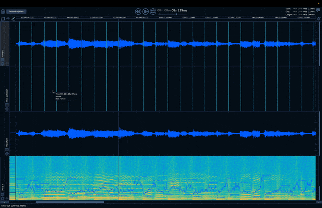

# Partiels

<p align="center"><a href="https://github.com/Ircam-Partiels/partiels/actions/workflows/ci.yml"></a></p>

**[Partiels](https://forum.ircam.fr/projects/detail/partiels/)** is a software suite for **analysing and exploring the content and characteristics** of sounds.

<p align="center"></p>

## Features

Partiels allows **analysis** of one or several audio files using Vamp plug-ins **loading** data files, **visualizing**, **editing**, **organizing**, and **exporting** the results as images or text files that can be used in other applications such as Max, Pure Data, Open Music, etc.

- Windows, Mac & Linux support
- Multiformat support
- Multichannel support
- Multiaudiofile support
- Analyzing audio with Vamp plug-ins
- Visualizing results as spectrogram, lines, and markers
- Textual and graphical editing of results 
- Organizing and ordering analyses in groups
- Exporting results to PNG, JPEG, CSV, LAB, JSON, CUE, REAPER & SDIF formats
- Loading results from CSV, LAB, JSON, CUE & SDIF formats
- Batch processing
- Command line interface to analyze, export, and convert results
- Consolidating documents for sharing

<p align="center"></p>


## Compatibility

Partiels is compatible on MacOS 10.13 and higher (Universal 2 - Intel/Silicon), Windows 10 & 11, and Linux.

<p align="center"></p>


## Compilation

The compilation system is based on [CMake](https://cmake.org/), for example:

```
git clone --recursive https://github.com/Ircam-Partiels/Partiels.git
cd partiels
cmake . -B build -G Ninja -DCMAKE_BUILD_TYPE=Debug
cmake --build build
ctest -C Debug -VV --test-dir build
```

## Credits

- **[Partiels](https://forum.ircam.fr/projects/detail/partiels/)** by Pierre Guillot at IRCAM IMR Department.
- **[Vamp SDK](https://github.com/vamp-plugins/vamp-plugin-sdk)** by Chris Cannam, copyright (c) 2005-2024 Chris Cannam and Centre for Digital Music, Queen Mary, University of London.
- **[Ircam Vamp Extension](https://github.com/Ircam-Partiels/ircam-vamp-extension)** by Pierre Guillot at IRCAM IMR department.  
- **[JUCE](https://juce.com/)** by Raw Material Software Limited.
- **[tinycolormap](https://github.com/yuki-koyama/tinycolormap)** by Yuki Koyama.
- **[JSON C++](https://github.com/nlohmann/json)** by Niels Lohmann.
- **[Magic Enum](https://github.com/Neargye/magic_enum)** by Daniil Goncharov.
- **[ASIO SDK](https://www.steinberg.net/developers/)** by Steinberg Media Technologies GmbH.
